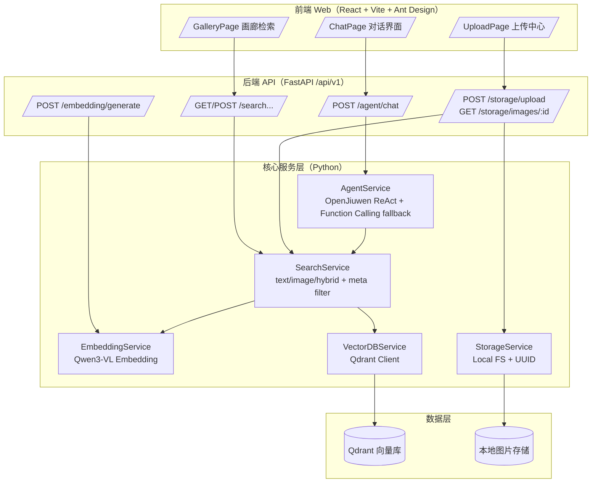

# 灵犀相册 Agent（Smart Album Agent）

灵犀相册 Agent 是一个“上传即索引、对话即找图”的智慧相册系统：用户只需用自然语言描述画面内容与筛选约束（日期、标签、文件名等），系统即可在同一对话窗口内完成规划、检索与结果呈现，并直接返回图片缩略图，实现从“记得线索”到“拿到照片”的闭环。

## 1. Agent 应用场景

### 1.1 场景概述

传统相册管理主要依赖目录、时间线与人工标签：

- 当用户只记得“语义线索”（如“海边日落”“有表格的截图”），关键词难以映射到结构化字段，检索成本高
- 当用户记得“时间/标签”等约束但描述不完整（如“1.18 的照片”“标签是猫”），需要多次筛选与翻找
- 当用户表达为“混合约束”（如“1.18 海边”），传统系统通常无法做“先过滤再排序”的组合检索

### 1.2 典型使用场景

1. **个人回忆检索**：用“画面语义”快速找图（人物/物体/场景/风格）
2. **工作资料管理**：从大量截图中定位“表格/报表/会议纪要/代码片段”等内容
3. **轻量知识归档**：按 `created_at` 与 `tags` 做结构化筛选，再用语义相似度精排
4. **以图搜图/图文混搜**：给一张参考图，找相似照片；或“文字 + 参考图”联合约束提升精度

### 1.3 交互示例（对话直出图片）

- 用户：帮我找找相册里关于表格的照片
- Agent：返回若干张缩略图（可点开预览），并给出可继续缩小范围的建议（如“加上日期/标签”）

## 2. 产品亮点与创新特性

### 2.1 三种检索范式统一到对话入口

灵犀相册将“语义检索、元数据检索、组合检索”统一到一个 `/chat` 对话入口，用户无需理解检索类型：

- **语义检索（Text/Image/Hybrid）**：基于多模态 Embedding 的向量相似度召回（支持文本搜图、以图搜图、图文混搜）
- **元数据检索（Metadata Filter）**：基于 Qdrant payload 的过滤与分页遍历（`created_at`、`tags` 等）
- **组合检索（Filter + Vector Ranking）**：先用日期/标签过滤候选集合，再做向量相似度排序

核心价值在于：把“检索策略选择”从用户侧前移到系统侧，由 Agent/服务端自动完成决策与编排。

### 2.2 “结果即 UI”的对话呈现方式

对话接口 `/api/v1/agent/chat` 直接返回 `results.images`，前端聊天窗口按统一协议渲染缩略图，不需要用户复制 ID 或跳转二级页面：

- 后端在搜索结果中补齐 `preview_url=/api/v1/storage/images/{id}`（见 [search_service.py](./Competition%20Code/app/services/search_service.py)）
- 前端在 chatStore 中将 `results.images` 统一映射为可预览的图片列表（见 [chatStore.ts](./Competition%20Code/frontend/src/store/chatStore.ts)）

这类“对话即工作流”的交互，显著降低检索与使用成本，适合比赛评审快速体验产品闭环。

### 2.3 工程化的高效数据处理：上传即索引（异步）

上传接口 `/api/v1/storage/upload` 支持异步索引：图片先落盘并立即返回，Embedding 计算与向量入库在后台任务执行（见 [storage.py](./Competition%20Code/app/routers/storage.py)）。

- 优点：避免长耗时索引阻塞上传体验；适配首次加载模型时的较长冷启动
- 可靠性：索引失败不会影响图片存储（“数据可用”优先），后续可补偿重建索引

### 2.4 Agent 双链路：OpenJiuwen ReAct + OpenAI 兼容降级

为了兼顾“智能规划能力”与“工程稳定性”，我们实现了双链路的 Agent 编排：

- **首选：OpenJiuwen ReActAgent**（工具型推理，能自动决定是否调用 search/tool）
- **降级：OpenAI Compatible Function Calling**（当 ReActAgent 异常时自动切换，保障对话可用）

该策略在比赛现场环境不确定（网络/证书/模型端差异）时更稳健，体现工程实践能力（见 [agent_service.py](./Competition%20Code/app/services/agent_service.py)）。

## 3. 技术架构与方案

### 3.1 整体架构图

### 3.2 前端技术栈（React + Vite + Ant Design）

前端采用 SPA 架构，核心技术栈与工程要点如下（以 `frontend/package.json` 为准）：

- **React 19 + TypeScript**：组件化与类型约束提升可维护性与可测试性
- **Vite**：开发态 HMR 快速迭代，构建链路清晰
- **Ant Design（antd）+ Icons**：快速搭建统一 UI 体系，聊天/上传/画廊均复用组件能力
- **Zustand**：状态管理（对话 session、消息列表、加载态等），避免复杂样板代码（见 [chatStore.ts](./Competition%20Code/frontend/src/store/chatStore.ts)）
- **Axios（拦截器）**：统一的 API Client，便于做鉴权/错误处理/超时控制

核心页面：

- `/chat`：对话式入口，渲染 `results.images` 缩略图并支持预览（见 [ChatPage.tsx](./Competition%20Code/frontend/src/pages/ChatPage.tsx)）
- `/gallery`：语义检索与画廊浏览入口（对接 `/api/v1/search/text` 等接口）
- `/upload`：支持拖拽/批量上传，附带标签与描述，可选择自动索引（见 [UploadPage.tsx](./Competition%20Code/frontend/src/pages/UploadPage.tsx)）

### 3.3 后端技术栈（FastAPI + Python 生态）

后端使用 FastAPI 构建高性能 API，基于生命周期钩子在启动时完成关键依赖初始化（见 [main.py](./Competition%20Code/app/main.py)）：

- 存储服务（本地文件落盘、图片信息提取）
- Qdrant 连接与 collection 初始化（含 payload 索引）
- Embedding 模型加载（Torch/Transformers）
- 搜索服务组装（Embedding + VectorDB + Storage）
- Agent 服务按需初始化（OpenJiuwen / OpenAI 兼容）

路由分层（`/api/v1` 前缀）：

- `/storage/*`：上传/下载/列表/删除
- `/search/*`：文本语义检索、以图搜图、图文混搜、统一搜索入口
- `/embedding/*`：多模态向量生成能力
- `/agent/*`：Agent 对话与动作编排入口

### 3.4 Agent 框架实现：OpenJiuwen 集成与应用

#### 3.4.1 OpenJiuwen ReActAgent 的工程落地

我们在服务端实现 AgentService，将 OpenJiuwen 的 ReActAgent 封装为可控的工程组件（见 [agent_service.py](./Competition%20Code/app/services/agent_service.py)）：

- 使用 `ReActAgentConfig + ModelConfig + BaseModelInfo` 构建模型接入层
- 通过 `@tool` 装饰器注册工具（如 `search_tool`、`get_current_time`），并在 Agent 初始化时绑定
- 使用 `ContextVar` 维护当前会话上下文，将工具检索结果回写到会话维度的 `images` 列表

#### 3.4.2 OpenAI 兼容 Function Calling 降级链路

当 ReActAgent 调用异常或 OpenJiuwen 不可用时，系统自动切换到 OpenAI 兼容工具调用：

- 明确 system prompt：区分“语义检索 vs 元数据检索 vs 组合检索”的调用条件
- 定义函数工具 `semantic_search_images/meta_search_images/get_photo_meta_schema` 等
- 多轮执行（最多 4 次迭代）以支持“调用工具 → 返回工具结果 → 模型归纳生成答案”的闭环

前端只依赖统一响应结构，因此 Agent 层切换不会影响 UI（见 [agent.py](./Competition%20Code/app/routers/agent.py)）。

### 3.5 Qdrant 向量数据库：使用方式与优势

Qdrant 在本方案中承担两类职责：向量相似度检索（召回/排序）与 payload 结构化过滤（元数据检索/组合检索）。

#### 3.5.1 使用方式（工程实现）

VectorDBService 支持三种部署模式，并在初始化时自动建库建索引（见 [vector_db_service.py](./Competition%20Code/app/services/vector_db_service.py)）：

- **local**：`QdrantClient(path=...)`，便于比赛提交与离线演示
- **docker**：`QdrantClient(host, port)`，便于环境一致化部署
- **cloud**：支持 API Key + HTTPS

collection 策略：

- 向量距离：`Distance.COSINE`
- payload 索引：
  - `tags`：KEYWORD 索引（支持多标签过滤）
  - `created_at`：DATETIME 索引（支持时间范围过滤）

检索接口使用 `query_points()`（新 API），并可叠加过滤条件：

- `MatchAny`：标签过滤
- `DatetimeRange`：日期范围过滤
- `HasIdCondition`：ID 集合过滤（用于“无年份日期”场景的候选集合约束）

#### 3.5.2 选择 Qdrant 的优势

- **向量检索与结构化过滤一体化**：天然适合“先筛选再相似度排序”的组合检索模式
- **工程集成成本低**：Python 客户端稳定，支持本地文件模式便于比赛交付
- **可扩展性强**：后续可接入 rerank、多集合分区、增量索引与更复杂的 payload schema

### 3.6 Embedding 模型：qwen3-vl-Embedding 的技术细节与表现

本项目使用 **Qwen3-VL-Embedding-2B** 作为本地多模态 Embedding 模型（见 [qwen3-vl-embedding-2B/README.md](./Competition%20Code/qwen3-vl-embedding-2B/README.md)），并以工程化方式封装为 EmbeddingService（见 [embedding_service.py](./Competition%20Code/app/services/embedding_service.py)）。

#### 3.6.1 模型特性（与系统能力的对应关系）

- **多模态输入统一表示**：文本、图片、图文混合可映射到同一向量空间，支持跨模态检索
- **向量维度**：默认可输出 2048 维；系统配置中 `VECTOR_DIMENSION=2048` 与 Qdrant collection 保持一致（见 [config.py](./Competition%20Code/app/config.py)）
- **Instruction-aware**：索引与查询分别使用不同 instruction，将“用于检索的表示学习”显式化；SearchService 在实现中做了索引/查询 instruction 对齐（见 [search_service.py](./Competition%20Code/app/services/search_service.py)）

#### 3.6.2 性能与效果参考（公开基准）

模型 README 给出了多模态检索基准（MMEB-V2 / MMTEB）结果，Qwen3-VL-Embedding-2B 在 2B 规模下取得了较强的综合表现（数值来自随项目提交的模型 README）：

| 基准 | 指标 | Qwen3-VL-Embedding-2B |
|---|---:|---:|
| MMEB-V2 | All | 73.2 |
| MMEB-V2 | Image Overall | 75.0 |
| MMEB-V2 | VisDoc Overall | 79.2 |
| MMTEB | Mean (Task) | 63.87 |

我们在产品侧的关键收益是：对“截图类/文档类/场景类”图片的语义描述匹配更稳定，尤其适合智慧相册的“自然语言找图”入口。

#### 3.6.3 部署与推理工程细节

- **本地推理封装**：EmbeddingService 将模型脚本加入 `sys.path`，以 `Qwen3VLEmbedder.process()` 统一处理文本/图片/图文输入（见 [embedding_service.py](./Competition%20Code/app/services/embedding_service.py)）
- **序列长度取舍**：模型本身支持更长上下文，但系统默认 `MAX_LENGTH=8192`，用于平衡内存占用与首轮响应延迟（见 [config.py](./Competition%20Code/app/config.py)）
- **设备选择**：启动时优先使用 CUDA（若可用），否则交由模型侧自动选择可用设备（见 [main.py](./Competition%20Code/app/main.py)）

## 4. 核心功能实现（流程拆解）

### 4.1 上传与索引：Upload → Embed → Qdrant

1. 前端上传图片（支持批量、标签、描述），调用 `POST /api/v1/storage/upload`
2. StorageService 生成 UUID、校验扩展名/大小、按日期分层落盘并提取基础信息（见 [storage_service.py](./Competition%20Code/app/services/storage_service.py)）
3. 若开启 `auto_index`：
   - 异步：后台任务生成图片向量并写入 Qdrant（推荐）
   - 同步：立即索引（适合调试，但可能阻塞）

### 4.2 语义检索：Text/Image/Hybrid → Vector Search

1. 查询输入（文本/图片/图文混合）进入 SearchService
2. EmbeddingService 调用 `Qwen3VLEmbedder.process()` 生成向量
3. VectorDBService 调用 Qdrant `query_points()` 进行相似度检索
4. 返回结果补齐 `preview_url`，前端可直接预览展示

对应 API：

- 文本语义检索：`GET /api/v1/search/text`
- 以图搜图：`GET /api/v1/search/image/{image_id}` 或 `POST /api/v1/search/image`
- 图文混搜：`POST /api/v1/search/hybrid`

### 4.3 组合检索：日期过滤 + 语义排序（关键创新点）

对“1.18 海边”这类混合表达，系统在服务端提供确定性的拆解与过滤策略（见 [split_date_and_query](./Competition%20Code/app/services/search_service.py)）：

1. 解析 `date_text`：
   - 有年份：构造 `created_at` 的 datetime range 过滤
   - 无年份：通过 scroll 遍历 payload，筛出匹配月日的 ID 集合，再以 `HasIdCondition` 过滤
2. 对剩余文本生成查询向量，叠加过滤条件做相似度排序

这样做的工程优势是：减少“纯靠大模型解析参数”导致的不确定性，保证组合检索在边界输入下仍可稳定工作。

### 4.4 对话式交互：Agent 自动编排检索工具

对话入口 `POST /api/v1/agent/chat` 的关键设计是“工具结果可回传 UI”：

1. 维护 `session_id` 作为多轮上下文
2. 首选 OpenJiuwen ReActAgent 进行工具推理与调用（需要时才调用 search tool）
3. Agent 工具调用后，将命中的图片结果挂载到响应 `results.images`
4. 前端聊天窗口自动渲染缩略图并支持预览

对应实现：后端 [agent.py](./Competition%20Code/app/routers/agent.py)，前端 [ChatPage.tsx](./Competition%20Code/frontend/src/pages/ChatPage.tsx)。

## 5. 工程实践与可交付性

- **配置与可移植性**：通过 `.env` 覆盖模型路径、Qdrant 模式、Agent 模型接入参数（见 [.env.template](./Competition%20Code/.env.template) 与 [config.py](./Competition%20Code/app/config.py)）
- **鲁棒性设计**：Agent 初始化阶段统一处理证书与 model 参数校验，失败时可降级到兼容链路或规则引擎
- **前端超时体验优化**：聊天请求使用更长超时与 AbortController，避免“慢检索被误判为网络错误”（见 [chatStore.ts](./Competition%20Code/frontend/src/store/chatStore.ts)）
- **安全性基本约束**：UUID 由服务端生成、扩展名白名单、最大文件限制，避免外部可控路径与超大文件风险（见 [storage_service.py](./Competition%20Code/app/services/storage_service.py)）

## 6. 目录结构（提交说明）

本项目为前后端一体化提交：

- 后端：`app/`（FastAPI + Embedding + Qdrant + Agent）
- 前端：`frontend/`（React + Vite + Ant Design）
- 模型：`qwen3-vl-embedding-2B/`（本地多模态 embedding）

更完整的运行方式请见项目根目录 [README.md]。

