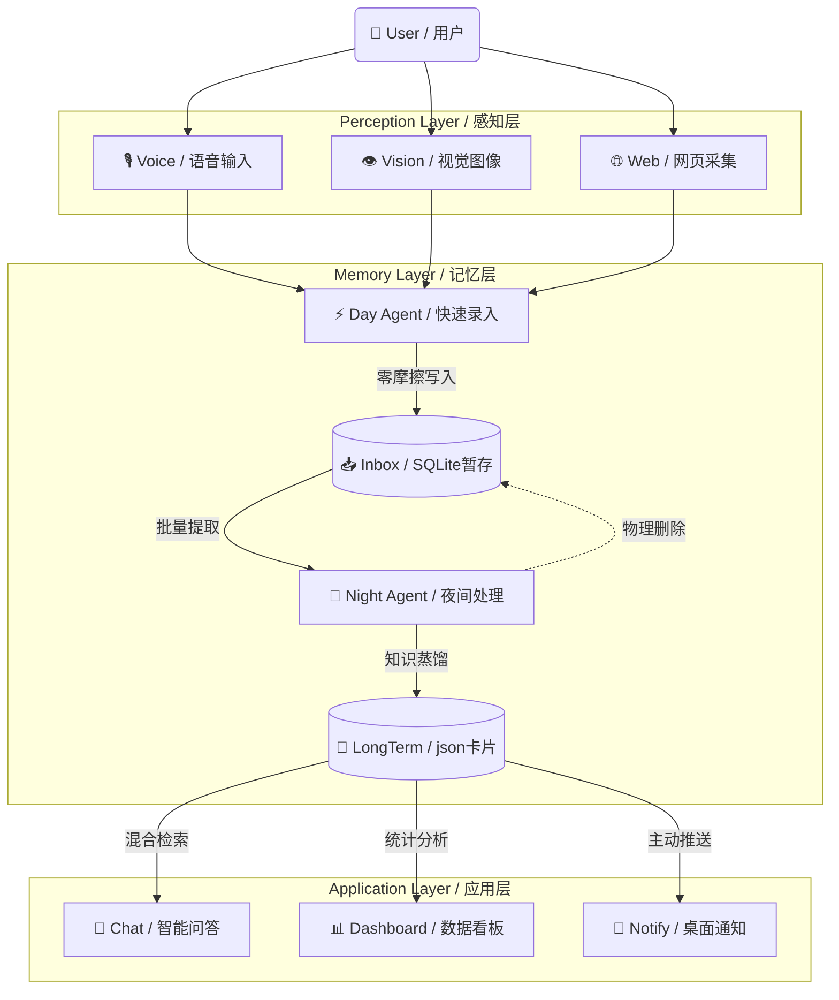

# 🧠 DeepDigest Lite

### 基于 OpenJiuwen 的仿生学个人知识智能体

---

**From Chaos to Crystal: Turn your information entropy into knowledge assets.**

*从混沌到结晶：将你的信息熵转化为知识资产*

[🚀 快速开始](#-快速开始) • [📖 设计理念](#-设计理念) • [🏗️ 系统架构](#-系统架构) • [✨ 核心功能](#-核心功能) • [🎯  亮点价值](#-亮点与价值)

---

## 🚀 快速开始

详细的**安装部署**与**环境变量配置**指南，请参阅独立的部署手册：

👉 **[📄 点击查看部署指南 (Deployment Guide)](deep_digest/README.md)**

---
## 📖 设计理念
### 🔥 痛点：存得越多，忘得越快
你也可能有过这样的经历：
*   微信“文件传输助手”里塞满了链接、截图和语音，**想找的时候永远翻不到**。
*   看到一篇好文章，点了“收藏”就等于**永久雪藏**。
*   突然有个灵感，但一想到要打开笔记软件、新建文档、起标题、选标签... **瞬间就不想记了**。

对于现代人来说，**“记录”本身变成了一种负担**。我们拼命囤积信息，却因为没有精力去整理反而让笔记变成了自己的累赘。

### 🧠 核心理念：像人脑一样“先记忆，后消化”

DeepDigest Lite 的设计灵感源于最自然的生物本能——**人脑的记忆机制**。它不强迫你在记录的那一刻去思考“这属于哪个分类”，而是将过程拆解为两个符合直觉的阶段：

| 系统 | 生物学隐喻 | 对应组件 | 核心职责 | 特性 |
|:---:|:---:|:---:|:---|:---|
| **System 1** | **🧠 海马体** | **Day Agent** | **极速录入** | 在白天忙碌时，你不需要做任何整理工作。你只管像丢垃圾一样**丢**给它。 |
| **System 2** | **🌙 大脑皮层** | **Night Agent** | **夜间造梦** | 像人类通过做梦来巩固记忆一样，定期（夜间）唤醒，进行深度推理、聚类分析与**物理熵减**。 |

---

## 🏗️ 系统架构

DeepDigest Lite 采用分层架构设计，确保数据流向的单向性与清晰度。

---

## ✨ 核心功能

### 1. ⚡ 全模态快速录入 (Day Agent)
无需再为不同格式打开不同 App，统一的入口处理所有信息流：
- **Web 剪藏**: 通过 Chrome 插件右键菜单一键捕获网页正文并存入碎片。
- **语音速记**: 集成 Whisper 模型，支持录音文件转文字，自动识别多语言。
- **视觉解析**: 截图或上传图片，自动提取代码、架构图逻辑或报错堆栈。
- **文档处理**: 直读 PDF/Word/TXT 文件，自动提取核心摘要。

### 2. 📉 深度知识蒸馏 (Night Agent)
模仿大脑皮层的夜间工作机制，对 Inbox 碎片进行深度加工：
- **智能分类**: 自动将碎片识别为 **Todo** (待办)、**Tech** (技术)、**Idea** (灵感)。
- **绝对时间锚定**: 能够理解 "下周三交报告" 等自然语言，将其转换为精确的 `YYYY-MM-DD` 截止日期。
- **物理熵减**: 知识归档后自动**物理删除**对应的 Inbox 碎片，确保暂存区永远清爽。

### 3. 🧠 记忆增强与检索 (RAG)
让沉淀的知识真正流动起来：
- **混合检索 (Hybrid Search)**: 结合 Vector Embedding (语义) 与 LLM 逻辑 (关键词) 的双路召回。
- **关联推荐**: 在浏览卡片时，自动推荐语义相关的其他知识点，发现隐性联系。
- **智能问答**: 基于个人知识库的 Chat 界面，帮助用户查找相关卡片，并附带**随便看看**、**生成周报**、**待办盘点**和**知识热点**的快速提问。

### 4. 🛠️ 实用工具集 (Utilities)
- **数据自主**: 所有数据存储于本地 SQLite 与 JSON 文件，支持**一键备份/恢复**。
- **格式互通**: 支持将知识卡片批量导出为 Markdown 格式，便于迁移至 Obsidian/Notion。
- **桌面伴侣**: 独立的桌面通知服务 (Notifier)，在任务截止时通过系统原生弹窗提醒。

---

## 🎯 亮点与价值

### 🛠️ 深度实践 OpenJiuwen 框架
本项目展示了 OpenJiuwen 框架在不同业务场景下的架构灵活性与扩展能力：
- **多范式 Agent 协同**: 
  - **流程式 (System 2)**: 利用 `WorkflowAgent` 构建 Night Agent，通过 **DAG** 编排 `Fetch` -> `Brain` -> `Archive` 的长程任务，实现复杂逻辑的自动闭环。
  - **交互式 (System 1)**: 基于 `ChatAgent` 与 `LocalFunction` 构建 Knowledge Agent，利用框架原生的 **RAG 能力** 实现精准的语义检索与问答。

- **深度组件化定制**:
  - 继承核心基类 `SimpleComponent` 创建了 `BrainNode` 组件，实现了对 **Context Window** 的精细化控制与 **Dynamic Prompt** 的动态注入。

- **原生工具链封装**:
  - 将本地 I/O 操作封装为标准的 `ToolComponent`，实现了业务逻辑（Python Code）与智能决策（LLM Reasoning）的解耦与通信。
  
### 📊 量化价值指标
- **信息噪音过滤率**: **90%** (相比原始收藏夹，仅有经过蒸馏的知识被保留)
- **知识连接率**: **60%+** (自动发现新旧知识点之间的关联)
- **节省工时**: 相比传统手动整理，平均每日节省 **20-30 分钟**。
#### 🚀 效能提升对照表

| 核心维度 | 🐢 传统手动管理 | ⚡ DeepDigest 智能体 | 提升效果 |
| :--- | :--- | :--- | :--- |
| **检索效率** | 🔍 依赖关键词，难以查找模糊记忆 | ⚡ **语义检索**，支持自然语言描述 | **秒级**精准召回 |
| **知识留存** | 🌫️ 收藏后极少再次阅读 (Read-Later) | 🧠 **主动推荐**，旧知识自动浮现 | **激活**沉睡知识 |
| **整理成本** | 😫 需定期投入精力分类打标 | 🛌 **Night Agent** 后台自动处理 | **零**人工干预 |
| **认知负担** | 🤯 需记忆"文件存在哪" | 🧘 只需关注"内容是什么" | **专注**深度思考 |

*注：基于开发环境的实际运行体验对比。*

### 🌐 生态完整性
构建了完整的应用生态闭环：
- **Web 端**: Streamlit 交互界面，用于检索与管理。
- **Extension**: 浏览器插件，解决网页端的数据采集问题。
- **Service**: 桌面后台服务，确保任务触达。

---

**Made with 🧠 & ❤️ by Monster Agent**

*Powered by OpenJiuwen Framework*

