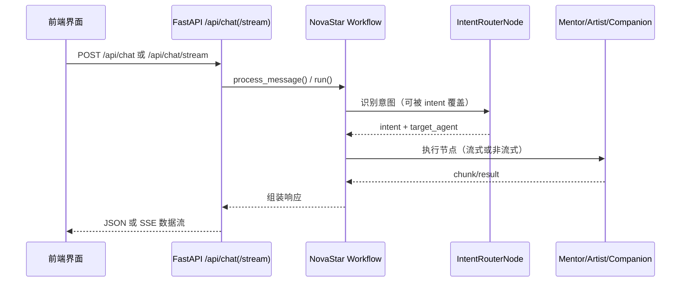
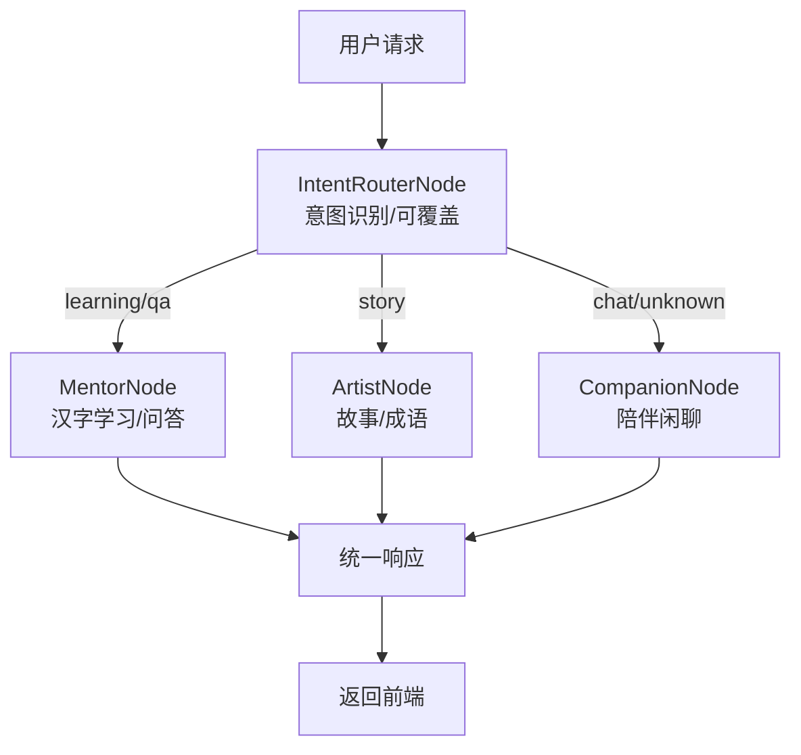

# NovaStar（启明星）

"启明星"全能AI伴学 Agent - 面向 3-12 岁儿童的 AI 学习与情感陪伴系统

## 1. Agent应用场景

### 1.1 场景概述

启明星（NovaStar）面向 3–12 岁儿童的家庭学习与陪伴场景，前端提供统一对话入口与快捷功能入口，后端通过多 Agent 协作完成意图识别、任务路由与内容生成。

### 1.2 典型用户场景

- **汉字学习**：识字、字形/字音/字义讲解与扩展练习
- **十万个为什么**：针对儿童提问的简明回答，可生成语音与配图
- **故事与成语**：睡前故事、成语故事多段落生成
- **陪伴聊天**：日常闲聊与情绪支持
- **语音输入**：录音转文字，降低儿童输入门槛

## 2. Agent技术方案

### 2.1 整体技术架构

```
前端 (HTML/JS/CSS + Voice UI)
    ↓ HTTP/SSE
FastAPI 服务器 (api_server.py)
    ↓
NovaStar Workflow (novastar/workflow/)
    ↓
Agent Nodes (novastar/nodes/)
    ↓
LLM + 多模态能力 (图像/语音/ASR)
```

### 2.2 核心技术组件

- **openjiuwen 框架**: Workflow/WorkflowAgent/BranchRouter 支撑工作流编排与路由
- **FastAPI 服务层**: 统一 API 入口，支持 SSE 流式输出
- **LLM 封装**: `LLMWrapper` 统一对话、图像生成、TTS、ASR 能力
- **多模态工具**: `multimodal_utils.py` 实现图像生成与文本转语音
- **前端交互**: 语音输入、对话流式渲染、故事与学习模态框
- **会话记录**: 进程内聊天历史存储与清理接口

### 2.3 前后端调用时序图



### 2.4 Agent 协作流程图



## 3. Agent功能

### 3.1 核心特性

- **意图识别与覆盖**：支持自动识别与前端显式 intent 覆盖
- **多 Agent 协作**：Commander/IntentRouter/Mentor/Artist/Companion 分工明确
- **多模态输出**：故事与问答支持图像与语音输出（TTS/图像生成）
- **语音输入**：前端录音 + 后端 ASR 转写
- **流式交互**：SSE 流式返回响应，前端实时渲染
- **会话历史**：提供历史查询与清理接口

### 3.2 主要能力清单

- **Mentor（智教）**：汉字学习、十万个为什么问答
- **Artist（创意）**：睡前故事、成语故事生成（多段落 + 配图 + 语音）
- **Companion（陪伴）**：闲聊与情绪支持

### 3.3 API 入口概览

- **POST** `/api/chat`：非流式聊天入口（支持 intent 指定）
- **POST** `/api/chat/stream`：SSE 流式聊天入口
- **POST** `/api/voice/transcribe`：语音转文本
- **GET** `/api/chat/history`：获取聊天历史
- **POST** `/api/chat/history/clear`：清空聊天历史

请求体示例（/api/chat）：

```json
{
  "query": "为什么天空是蓝色的？",
  "user_id": "default_user",
  "conversation_id": "可选",
  "intent": "可选：learning/story/qa/chat",
  "context": {"age": 6}
}
```

## 4. Agent运行

### 4.1 uv 环境安装

前置要求：

- Python 3.11.4+
- [uv](https://github.com/astral-sh/uv) 包管理器

安装依赖：

```bash
# 同步所有依赖（包括开发依赖）
uv sync

# 仅安装生产依赖
uv sync --no-dev
```

配置环境变量：

```bash
cp env.example .env
# 编辑 .env，至少配置 OPENAI_API_KEY
```

### 4.2 后端服务启动

```bash
# 方式1: 直接运行
uv run python api_server.py

# 方式2: 使用uvicorn
uv run uvicorn api_server:app --host 0.0.0.0 --port 8000 --reload
```

### 4.3 前端服务启动

推荐通过后端静态资源访问（避免 `file://` 的跨域限制）：

```
http://localhost:8000/static/index.html
```
