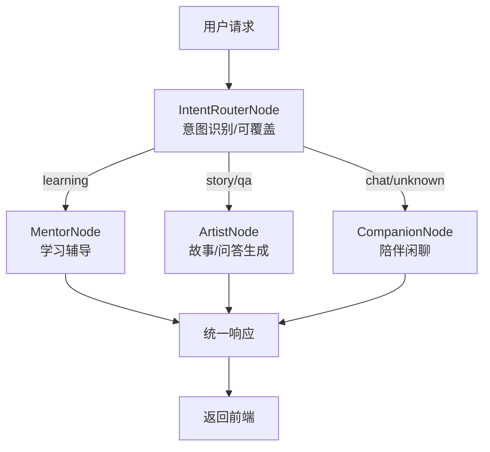
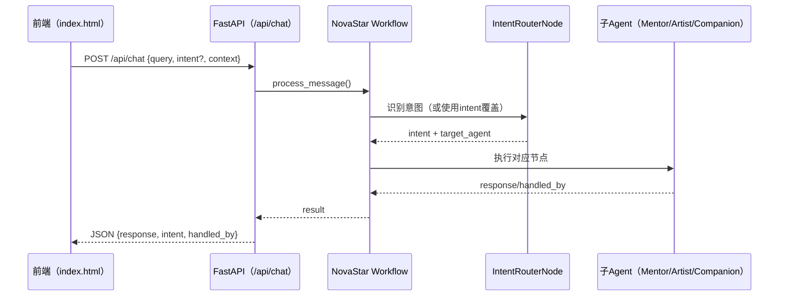

# 启明星（NovaStar）AI 伴学 Agent（当前实现说明）

## 1. 项目概览

启明星（NovaStar）是面向 3–12 岁儿童的 AI 学习与陪伴系统，当前版本以**文本交互**为主，通过多 Agent 协作实现意图识别、任务路由与内容生成。前端提供统一对话入口与快捷功能入口，后端通过单一主入口 `/api/chat` 对所有请求进行处理。

当前版本特性：
- 仅支持文本输入与流式文本输出
- 单一 API 入口（含流式接口）
- 多 Agent 协作（学习、故事、陪伴）
- 前端展示为内容卡片 + 故事模态框

不包含的功能：
- 语音交互
- 游戏模块
- 家长端/数据看板

---

## 2. 核心价值

| 真实痛点 | 当前产品能力 | 价值 |
|---|---|---|
| 孩子提问频繁、家长难以即时回应 | 十万个为什么入口 + 自动意图识别 | 即时解答与陪伴 |
| 学习内容零散 | 学习入口（汉字）直达智教 Agent | 聚焦学习主题 |
| 睡前/故事需求 | 故事生成入口 + 故事模态框 | 轻量内容陪伴 |

---

## 3. 核心功能结构

### 3.1 前端功能

- **文本对话**：输入问题后展示回答卡片
- **快捷入口**：
  - 十万个为什么（QA）
  - 睡前故事（Story）
  - 汉字学习（Learning）
  - 汉字学习（Learning）
- **故事模态框**：展示故事生成内容

### 3.2 后端能力

- 单一主入口 `/api/chat`，可选 `/api/chat/stream`
- 通过 `intent` 参数支持“直达某类意图”
- Workflow 内部完成意图识别与路由

---

## 4. 系统架构与 Agent 协作

### 4.1 Agent 角色

- **IntentRouterNode**：意图识别与路由
- **MentorNode**：学习类问题（汉字）
- **ArtistNode**：故事与文本问答生成
- **CompanionNode**：陪伴闲聊

### 4.2 Agent 协作流程



### 4.3 前后端调用时序



---

## 5. 前端体验与展示

- **Nova Orb**：视觉主元素，用于状态反馈
- **内容卡片**：问答、学习内容以卡片形式展示
- **流式文本**：回答可逐字展示
- **故事模态框**：故事内容独立展示

---

## 6. 边界与限制

- 仅文本交互，无语音输入与录音
- 无游戏模块
- 无家长端/统计看板

---

## 7. 运行方式

### 7.1 后端服务

```bash
uv run uvicorn api_server:app --host 0.0.0.0 --port 8000 --reload
```

### 7.2 前端访问

推荐通过后端静态资源访问：

```
http://localhost:8000/static/index.html
```

---

## 8. 后续可扩展方向（Roadmap）

- 语音输入与语音合成
- 家长端分析面板
- 更多学习主题
- 长期记忆与个性化推荐
