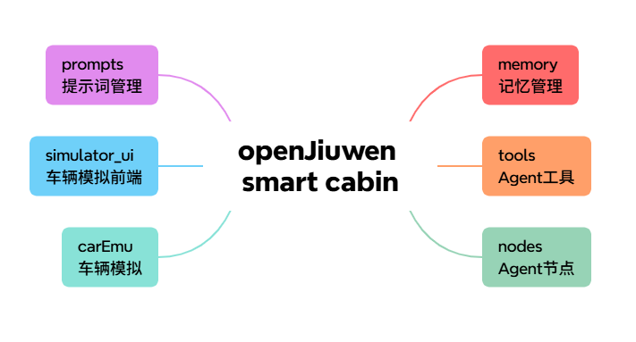
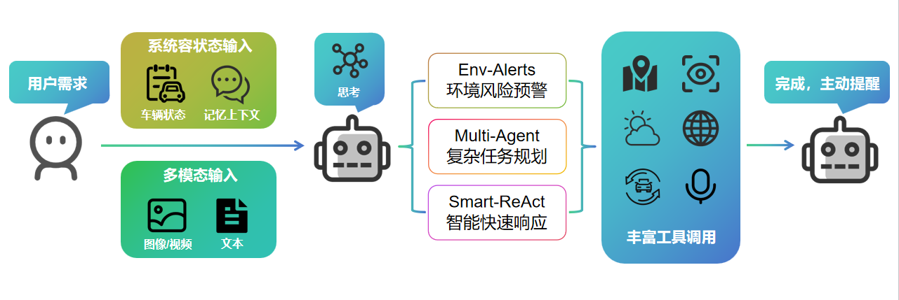

<p align="center">
  
</p>

<h1 align="center">openJiuwen 智能座舱（openJiuwen Smart Cabin）</h1>

<p align="center">
  <b>面向智能座舱与车机交互的多模态模拟器 —— 可视化 Web UI、场景联动、车控工具链、地图导航、视觉问答、乘客识别与长期记忆</b>
</p>

<p align="center">
  <a href="#-核心功能">核心功能</a> •
  <a href="#-架构详解">架构详解</a> •
  <a href="#-快速开始">快速开始</a> •
  <a href="#-项目结构">项目结构</a> •
  <a href="#-常见问题">常见问题</a>
</p>

<p align="center">
  
  
  
</p>

---

## 💡 项目简介

**openJiuwen 智能座舱**聚焦“自然语言 + 多模态 + 可执行工具链”的真实车内交互需求：你只需要告诉它“你想做什么”，它会自行理解上下文、规划步骤、调用车控/导航/视觉/搜索/TTS 等工具完成任务，并把结果同步到 Web UI。

> 🎯 **目标：用可复现的模拟器，把座舱智能体的端到端链路跑通、看得见、可二次开发。**

## ✨ 核心功能

| 🚗 车控联动 | 🗺️ 导航与出行 | 👁️ 多模态理解 | 🧠 记忆与个性化 |
|:---:|:---:|:---:|:---:|
| 空调/车窗/座椅/氛围灯等 | 多途经点规划、路况联动 | 图片/视频问答、摄像头模拟 | 主驾/副驾档案、长期记忆 |
| 场景模式一键触发 | POI 搜索与路线建议 | 路牌识别、车位判断 | 偏好自动匹配与更新 |

## 🏗️ 架构详解

<p align="center">
  
  <br/>
  <small>图1：智能座舱项目架构总览</small>
</p>

<p align="center">
  
  <br/>
  <small>图2：智能座舱Agent执行链路</small>
</p>

如果你想了解完整的“多模态输入 → 状态融合 → 思考执行 → 工具联动 → 主动回复”链路说明，请阅读：`openJiuwen智能座舱Agent.md`。

## 🚀 快速开始

### 1) 安装依赖

```bash
pip install -r requirements.txt
```

### 2) 配置环境变量

```bash
cp .env.example .env
```

### 3) 启动模拟器

```bash
# 方式1：同时启动 Web UI 和 Agent（推荐）
python run_simulator.py

# 方式2：仅启动 Web UI
python run_simulator.py --ui-only

# 方式3：仅启动 Agent
python smart_agent.py
```

### 4) 访问界面

浏览器打开：`http://localhost:8080`。

## 🎬 演示场景（示例）

### 场景1：智能上车

```
用户：小九，我上车了

助手：
1. 自动查询天气
2. 根据温度调整空调（如 30°C → 制冷 22°C）
3. 开启座椅通风
4. 播放音乐
5. 询问是否需要导航
```

### 场景2：场景联动

```
用户：启动回家模式

助手：
1. 空调设为 24°C 自动模式
2. 氛围灯设为暖色
3. 播放轻松音乐
4. 开启座椅按摩
```

可用场景：回家模式 / 上班模式 / 送娃模式 / 约会模式 / 午休模式 / 派对模式 / 冬季模式 / 夏季模式

### 场景3：多模态识别

```
用户：[上传街景图片] 这是什么地方？能导航过去吗？
用户：[上传停车位图片] 这个车位能停吗？
用户：[上传路牌图片] 这个指示牌写的什么？
```

## 🧩 乘客识别与摄像头模拟

### 设置乘客身份

1. Web UI 左侧“乘客面板”点击主驾/副驾头像
2. 上传头像并输入姓名
3. 系统自动创建乘客档案

### 摄像头模拟

1. Web UI 右侧“摄像头模拟”面板点击摄像头框
2. 上传图片模拟该位置摄像头画面
3. 在“视觉问答”面板输入问题

## 📁 项目结构

```text
root/
├── .env.example          # 环境变量模板
├── requirements.txt      # Python 依赖
├── run_simulator.py      # 启动脚本（推荐）
├── smart_agent.py        # Agent 入口
├── carEmu/               # 车机模拟器
├── memory/               # 长期记忆模块
├── tools/                # 工具集合（车控/天气/地图/视觉等）
├── simulator_ui/         # Web UI（FastAPI + 静态前端）
├── nodes/                # Agent 节点与流程
└── prompts/              # 提示词模板
```

## ❓ 常见问题

- Web UI 显示不正常：`pip install fastapi uvicorn websockets`
- TTS 不发声（Windows）：`pip install pyttsx3`
- 多模态不工作：配置 `.env` 中 `VISION_MODEL_NAME`
- 状态不同步：刷新 Web 页面或检查 WebSocket 连接
- 乘客信息保存失败：检查 `car_state.json` 写入权限
