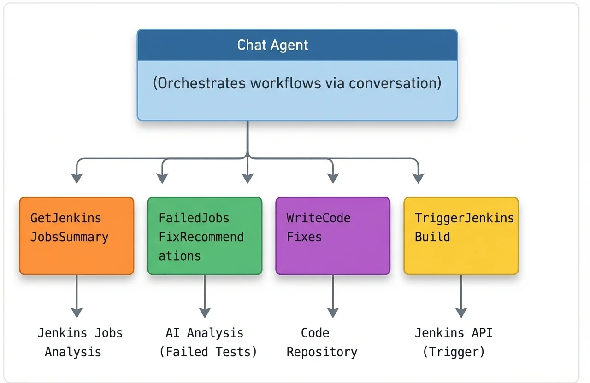

# CodyFix - 智能AI CI/CD工作流

一个智能自动化系统，用于监控Jenkins流水线、分析测试失败并自动生成和应用代码修复。

## 概述

本项目实现了一个智能AI工作流，能够自主处理CI/CD调试周期。CodyFix作为对话式聊天代理，协调四个专业化工作流，将失败的Jenkins构建转化为成功的构建，最大限度地减少人工干预。

## 架构



## 工作流

### 1. GetJenkinsJobsSummary（获取Jenkins任务摘要）

检索并分析最新的Jenkins构建日志。

**职责：**
- 从Jenkins API获取最近的任务执行日志
- 解析测试结果和构建输出
- 将测试分类为成功和失败两组
- 生成结构化摘要报告

**输出：** 区分通过和失败测试的摘要，包括失败详情和堆栈跟踪。

### 2. FailedJobsFixRecommendations（失败任务修复建议）

分析失败的测试并生成可执行的修复建议。

**职责：**
- 从摘要工作流接收失败测试详情
- 分析错误消息、堆栈跟踪和测试上下文
- 识别失败的根本原因
- 生成具体、可执行的修复建议

**输出：** 每个失败测试的详细建议，包括建议的代码更改和受影响的文件。

### 3. WriteCodeFixes（编写代码修复）

将建议的修复应用到代码库。

**职责：**
- 接收修复建议作为输入
- 将代码更改应用到代码库
- 提交并推送修复

**输出：** 已提交到代码库的代码修复。

### 4. TriggerJenkinsBuild（触发Jenkins构建）

触发新的Jenkins构建以验证已应用的修复。

**职责：**
- 通过API启动新的Jenkins构建
- 监控构建触发状态

**输出：** 新触发的Jenkins任务以验证更改。

## CodyFix聊天代理

系统通过CodyFix进行控制，这是一个对话式聊天代理，作为主要交互界面。

**功能：**
- 接受自然语言命令
- 将请求路由到适当的工作流
- 提供状态更新和摘要
- 允许在任何阶段进行手动干预

**交互示例：**

```
用户：检查最新的Jenkins任务
CodyFix：正在运行GetJenkinsJobsSummary...
         发现15个测试：12个通过，3个失败。
         失败的测试：TestUserAuth、TestPaymentFlow、TestDataSync

用户：为失败的测试推荐修复方案
CodyFix：我将为失败的任务获取修复建议...

用户：根据建议修复代码
CodyFix：我将根据建议修复代码...

用户：触发Jenkins任务
CodyFix：我将为您触发Jenkins任务。
         摘要：成功触发Jenkins任务。
         任务已排队，响应代码为201。
```

## 工作流流水线

完整的自动化周期：

1. **触发** — CodyFix接收检查Jenkins状态的请求
2. **摘要** — GetJenkinsJobsSummary获取并分类测试结果
3. **分析** — FailedJobsFixRecommendations检查失败并提出解决方案
4. **修复** — WriteCodeFixes将更改应用到代码库
5. **重建** — TriggerJenkinsBuild启动新的Jenkins构建
6. **验证** — 监控新的构建结果
7. **重复** — 如果失败持续，可以使用改进的修复重复循环

## 快速开始

### 前置条件

- Jiuwen实例用于工作流编排
- 具有适当凭据的Jenkins API访问权限
- 用于应用修复的代码库写入权限

### 配置

1. 设置Jenkins API凭据
2. 配置代码库访问令牌
3. 将四个工作流部署到您的Jiuwen实例
4. 将CodyFix连接到工作流端点

### 使用方法

与CodyFix开始对话，使用自然语言来：

- 检查当前Jenkins构建状态
- 获取特定失败的详情
- 请求自动修复
- 监控修复进度

---

**CodyFix — 让红色构建变绿色。**
