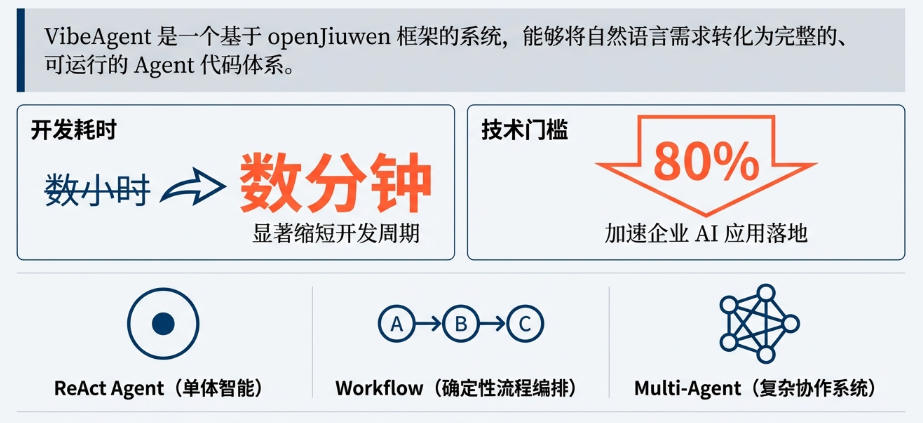
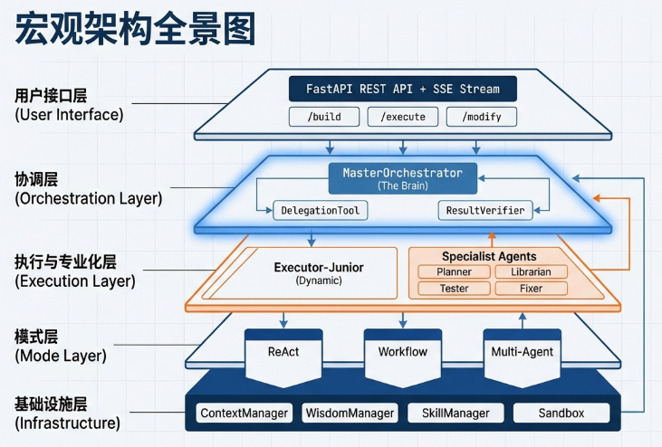
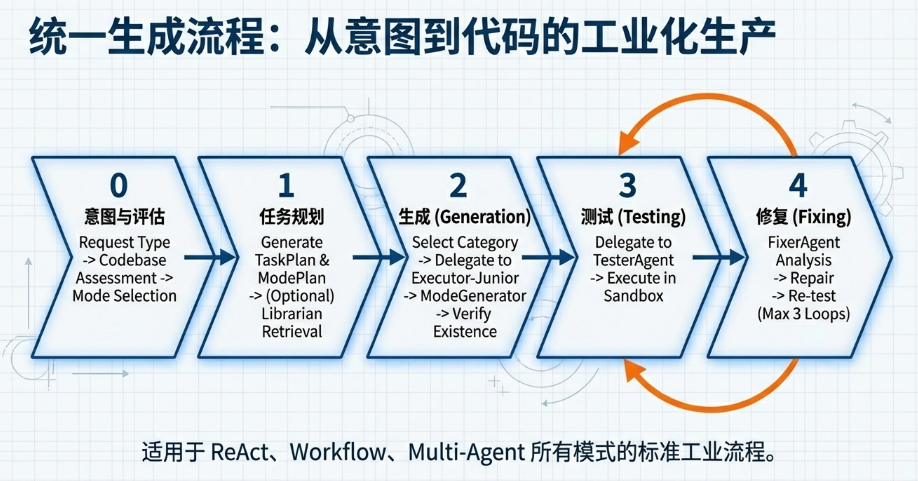

# VibeAgent 架构设计文档

## 📋 文档概述

VibeAgent 是基于 **openJiuwen 框架**的智能 Agent 自动生成系统，通过自然语言描述自动生成完整的、可运行的 openJiuwen 代码。系统采用多 Agent 协作架构，支持三种生成模式：**ReAct Agent**、**Workflow** 和 **Multi-Agent**。

在架构层面，openJiuwen 提供了 **Agent 抽象、Runtime 执行引擎、ContextEngine 上下文管理、Tool 能力扩展机制** 等稳定的基础设施，我们在此之上专注实现多 Agent 协作策略、模式生成器和技能体系，使整个系统既保持了工程落地的可靠性，又能在产品层面快速演进。



---

## 一、应用场景

### 目标用户
- **开发者**：快速原型开发，从"描述需求"到"运行代码"从数小时缩短至数分钟
- **企业用户**：批量生成 Agent，降低技术门槛 80%，加速 AI 应用落地
- **非技术用户**：零代码构建生产级 AI 应用

### 典型场景
- **快速原型**：3-5 分钟生成完整 Workflow 代码
- **复杂系统**：5-8 分钟生成 Multi-Agent 协作系统
- **迭代开发**：2-3 分钟增量修改现有工作流

---

## 二、技术方案

### 2.1 整体架构

VibeAgent 采用**主协调器-执行器（Master-Executor）**架构模式，核心设计理念是"职责分离"和"不信任原则"。



```
┌─────────────────────────────────────────────────────────────┐
│                   用户接口层 (User Interface)                 │
│  FastAPI REST API + SSE 流式响应                              │
│  - /api/v1/agent/build    (构建智能体)                       │
│  - /api/v1/agent/execute  (执行智能体)                       │
│  - /api/v1/agent/modify   (修改智能体)                        │
└──────────────────────┬──────────────────────────────────────┘
                       │
┌──────────────────────▼──────────────────────────────────────┐
│                   协调层 (Orchestration Layer)                 │
│  ┌──────────────────────────────────────────────────────┐  │
│  │  主协调器 (MasterOrchestrator)                       │  │
│  │  - 意图识别 (Intent Gate)                           │  │
│  │  - 任务规划 (Task Planning)                          │  │
│  │  - 任务委托 (Task Delegation)                        │  │
│  │  - 结果验证 (Result Verification)                    │  │
│  │  - 智慧积累 (Wisdom Accumulation)                    │  │
│  └──────────────────────────────────────────────────────┘  │
│  ┌──────────────────────────────────────────────────────┐  │
│  │  委托工具 (DelegationTool)                          │  │
│  │  - 类别模式委托 (Category-based)                     │  │
│  │  - Agent模式委托 (Agent-based)                       │  │
│  │  - 技能注入 (Skills Injection)                       │  │
│  └──────────────────────────────────────────────────────┘  │
│  ┌──────────────────────────────────────────────────────┐  │
│  │  结果验证器 (ResultVerifier)                         │  │
│  │  - 结构验收 (文件完整性)                              │  │
│  │  - 静态验收 (语法检查)                                │  │
│  │  - 运行验收 (沙箱测试)                                │  │
│  │  - 需求验收 (需求匹配度)                              │  │
│  └──────────────────────────────────────────────────────┘  │
└──────────────────────┬──────────────────────────────────────┘
                       │
        ┌──────────────┴──────────────┐
        │                             │
┌───────▼────────┐         ┌──────────▼──────────┐
│  执行层        │         │  专业化层            │
│ (Execution)    │         │ (Specialization)     │
│                │         │                      │
│ 动态执行器     │         │ 预定义专家Agent       │
│ (Executor-     │         │ (4个核心)            │
│  Junior)       │         │                      │
│                │         │ - PlannerAgent      │
│ 2个核心类别:   │         │ - LibrarianAgent    │
│ - general      │         │ - TesterAgent       │
│ - docgen       │         │ - FixerAgent        │
└────────────────┘         └─────────────────────┘
        │                             │
        └──────────────┬──────────────┘
                       │
┌──────────────────────▼──────────────────────────────────────┐
│                   模式层 (Mode Layer)                          │
│  ┌──────────────┐  ┌──────────────┐  ┌──────────────┐      │
│  │ ReAct模式    │  │ Workflow模式 │  │ Multi-Agent  │      │
│  │ (ReActAgent) │  │ (Workflow)   │  │ (Hierarchical│      │
│  │              │  │              │  │  Group)      │      │
│  └──────────────┘  └──────────────┘  └──────────────┘      │
│                                                              │
│  统一流程：规划 → 生成 → 测试 → 修复                          │
└──────────────────────┬──────────────────────────────────────┘
                       │
┌──────────────────────▼──────────────────────────────────────┐
│                   基础设施层 (Infrastructure Layer)            │
│  - ContextManager (上下文管理)                                │
│  - WisdomManager (智慧积累)                                  │
│  - SessionManager (会话管理)                                 │
│  - SkillManager (技能管理)                                   │
│  - Sandbox (沙箱执行)                                        │
└─────────────────────────────────────────────────────────────┘
```

### 2.2 核心设计原则

1. **职责分离**：主协调器只协调不执行，执行器只执行不协调
2. **不信任原则**：四层验证机制（结构、静态、运行、需求），确保代码质量
3. **技能驱动**：通过技能文件扩展能力，无需修改代码

**openJiuwen 在架构中的作用**：  
openJiuwen 内置了 AgentConfig、Runtime、ContextEngine、Tool 等通用能力，我们在其之上实现 MasterOrchestrator、DelegationTool、ModeGenerator、SkillManager 等业务层组件，从而形成「底座由框架保障、上层聚焦业务智能」的分层设计，显著简化了多 Agent 系统的工程实现难度。

### 2.3 核心组件

| 组件 | 职责 | 关键特性 |
|------|------|---------|
| **MasterOrchestrator** | 主协调器 | 只协调不执行，通过 DelegationTool 委托任务，严格验证结果 |
| **DelegationTool** | 委托工具 | 统一委托接口，支持类别模式（动态执行器）和 Agent 模式（专业化 Agent） |
| **Executor-Junior** | 动态执行器 | 根据类别（general/docgen）动态创建，直接执行代码生成任务 |
| **ModeGenerator** | 模式生成器 | 统一接口，三种实现（Workflow/ReAct/Multi-Agent），支持思考过程生成 |
| **专业化 Agent** | 专家系统 | PlannerAgent（规划）、TesterAgent（测试）、FixerAgent（修复）、LibrarianAgent（检索） |
| **基础设施** | 支撑组件 | ContextManager（上下文）、WisdomManager（智慧积累）、SkillManager（技能管理）、Sandbox（沙箱执行） |

### 2.5 统一流程

三种模式（ReAct、Workflow、Multi-Agent）采用统一的生成流程：



```
用户请求 "创建一个情感咨询专家"
    ↓
[阶段 0: 意图识别和代码库评估]
    ├─ 主协调器识别请求类型（Open-ended）
    ├─ 评估代码库状态（Greenfield）
    └─ 确定 Agent 模式（Workflow）
    ↓
[阶段 1: 任务规划]
    ├─ 生成 TaskPlan（L0）：plan_mode → generate → test → fix
    ├─ 生成 ModePlan（L1）：WorkflowPlan/ReActPlan/MultiAgentPlan
    └─ 可选：检索 openJiuwen 文档（LibrarianAgent）
    ↓
[阶段 2: 生成]
    ├─ 根据模式选择类别和技能
    ├─ 委托给动态执行器（Executor-Junior）
    ├─ 执行器使用模式生成器生成代码
    └─ 验证生成的文件存在（ResultVerifier）
    ↓
[阶段 3: 测试]
    ├─ 委托给 TesterAgent
    ├─ 在沙箱中执行测试
    └─ 返回测试结果
    ↓
[阶段 4: 修复（如果需要）]
    ├─ 如果测试失败，委托给 FixerAgent
    ├─ 修复代码错误
    ├─ 重新测试
    └─ 最多迭代 3 次
    ↓
[完成]
    └─ 输出完整代码，更新智慧（WisdomManager）
```

---

## 三、关键特性

### 1. 零代码生成 + 多模式支持

**核心能力**：
- ✅ **自然语言到代码**：只需描述需求，自动生成完整的 openJiuwen 代码
- ✅ **三种模式支持**：Workflow（流程化）、ReAct（单 Agent）、Multi-Agent（复杂协作）
- ✅ **实时流式反馈**：SSE 实时展示生成进度和思考过程
- ✅ **开箱即用**：生成的代码符合框架规范，可直接运行

### 2. 自动化测试与修复

**核心能力**：
- ✅ **四层验证机制**：结构验收（文件完整性）→ 静态验收（语法检查）→ 运行验收（沙箱测试）→ 需求验收（需求匹配）
- ✅ **自动修复循环**：FixerAgent 自动分析错误并修复，最多3次迭代
- ✅ **沙箱隔离执行**：确保测试环境安全，支持多轮对话

### 3. 技能驱动扩展 + 智慧积累

**核心能力**：
- ✅ **技能驱动架构**：通过技能文件（Markdown + YAML）扩展能力，无需修改代码
- ✅ **智慧积累机制**：跨任务知识传递，系统越用越聪明
- ✅ **灵活组合**：支持多技能组合，按需加载 references（token 预算控制）

---

## 四、技术竞争力

### 架构设计
- **职责分离架构**：主协调器-执行器模式，清晰的职责边界，易于维护和扩展
- **不信任原则**：严格的四层验证机制，确保代码质量
- **技能驱动扩展**：通过技能文件扩展能力，符合开闭原则，无需修改代码

### 技术实现
- **深度集成 openJiuwen**：充分利用框架能力（ContextEngine、Runtime、Agent），生成的代码自然对齐 openJiuwen 的最佳实践，同时在 Agent 生命周期管理、上下文管理和工具调用协议等方面复用成熟能力，整体降低了系统的复杂度和维护成本
- **多 Agent 协作**：专业化分工（规划、测试、修复、检索），动态执行器按需创建
- **智能验证修复**：四层验证 + 自动修复循环，确保最终代码可运行

### 扩展性
- **技能扩展**：Markdown + YAML 技能文件，灵活组合，易于维护
- **类别扩展**：YAML 配置文件扩展执行器类别，支持不同模型配置
- **模式扩展**：ModeGenerator 统一接口，插件化设计，易于添加新模式

---

## 五、技术栈

| 类别 | 技术 | 用途 |
|------|------|------|
| **后端框架** | Python 3.11+, FastAPI | 核心开发语言，Web 框架（REST API + SSE） |
| **AI 框架** | openJiuwen | Agent、Runtime、ContextEngine |
| **基础设施** | Pydantic, loguru, asyncio | 数据验证、日志系统、异步处理 |
| **执行环境** | Sandbox | 隔离的 Python 执行环境 |

---

## 六、总结

VibeAgent 通过**主协调器-执行器架构**、**技能驱动扩展**、**四层验证机制**、**智慧积累**等核心技术，实现了从自然语言到可运行代码的端到端转换。

**核心价值**：
- 降低技术门槛：让非技术人员也能构建 AI 应用
- 提升开发效率：从数小时缩短至数分钟
- 确保代码质量：自动化测试和修复机制
- 支持持续迭代：智慧积累和迭代式修改

---

**文档版本**：v1.0  
**最后更新**：2026-01-20
