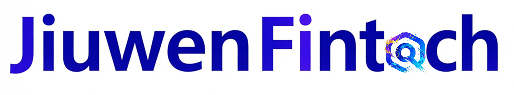
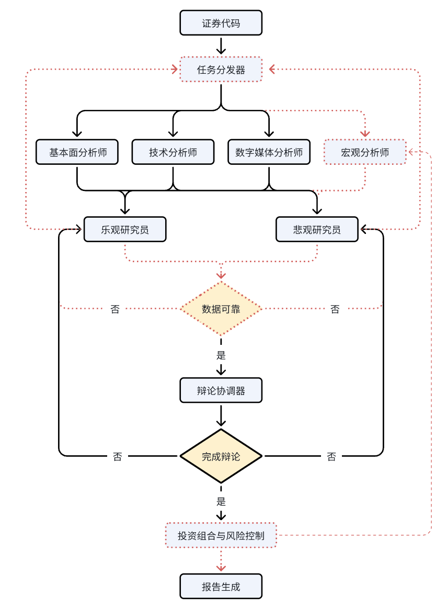
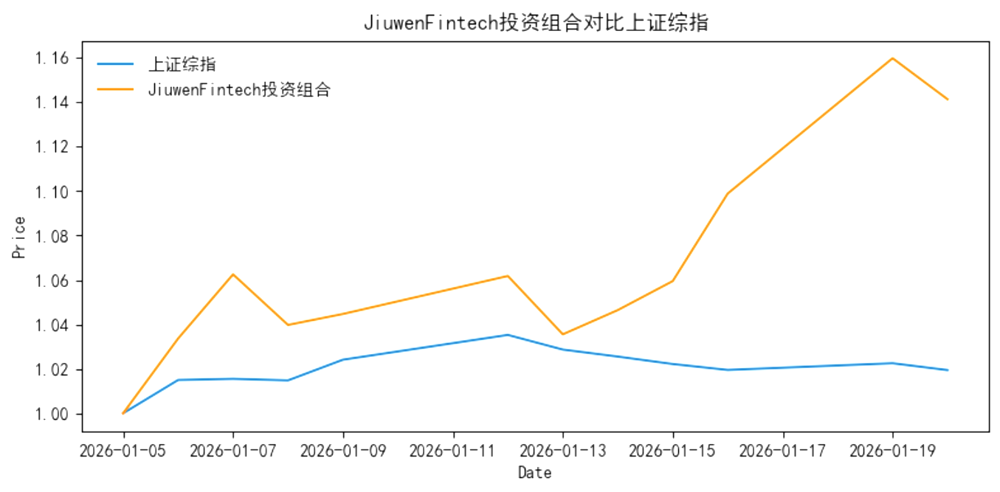
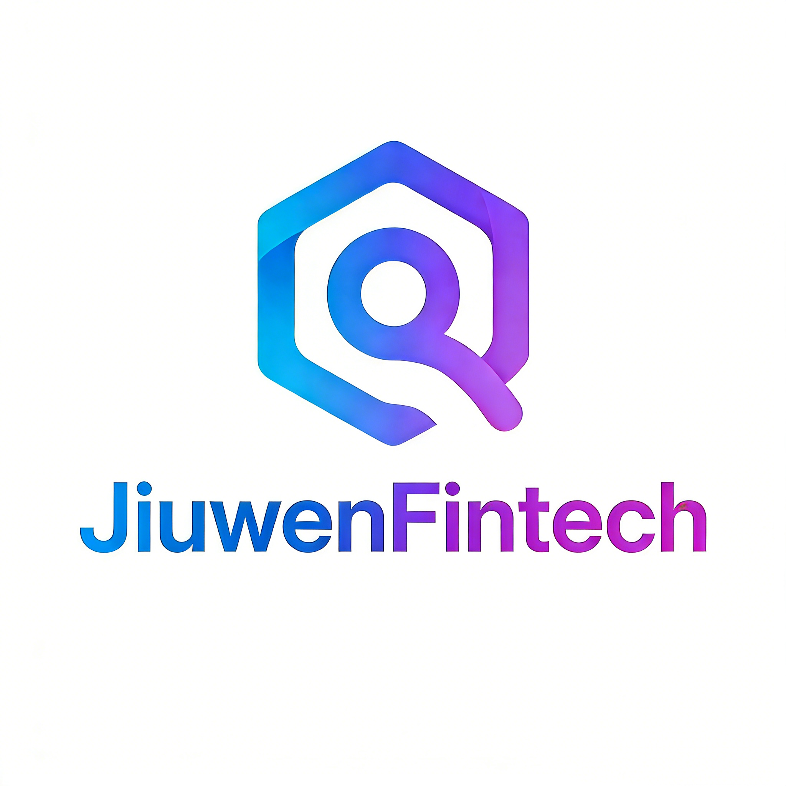

<div align="center">
  
</div>


[](https://opensource.org/licenses/Apache-2.0)

## 项目概述
JiuwenFintech Agent是一个基于**多智能体系统（Multi-Agent System, MAS）构建的智能投研报告生成系统**，旨在为个人投资者及专业投研机构提供上市公司股票投资价值的深度分析与决策支持。
该系统通过**模拟专业证券公司投研团队**的协作模式，集成多个专业化AI智能体，实现任务分解、协同推理与交叉校验，显著提升分析效率与覆盖广度。
每个智能体具备领域专精能力，并能在统一协调机制下进行信息交换与共识达成，模拟真实投研团队的协作模式，旨在为用户提供**专业级、全方位、多角度、自动化、可信赖**的证券分析服务。

## 系统架构
JiuwenFintech Agent采用**三层级联式多智能体架构（Three-Tier Cascaded Multi-Agent Architecture）**，通过角色分工、任务递进与观点博弈机制，模拟专业投研团队从数据处理到投资决策的完整工作流。
各层级智能体具备明确职责边界与上下文感知能力，形成“**感知 → 分析 → 辩证 → 决策**”的闭环推理链。

<div align="center">
  
</div>


| 层级 | 角色 | 功能描述 |
|------|------|----------|
| **分析师层** | 股票分析师、基本篇分析师、社交媒体分析师等 | 对工具获取的原始数据进行初步、单维度的专业分析，输出细分领域的分析报告。 |
| **研究员层** | 积极研究员（乐观）、消极研究员（悲观） | 基于分析师报告进行多空观点提炼与激烈辩论，分别阐述投资机会与风险。 |
| **报告生成层** | 报告生成器 | 总结研究员辩论的核心观点，综合评估机会与风险，输出最终分析报告与投资建议。 |

JiuwenFintech系统以**股票代码**为输入，通过并发地将任务分发给分析师层所有智能体，随后所有分析师智能体分别在其细分领域对目标上市公司进行深入、全面的评估。
分析师层所有智能体完成细分领域分析并生成报告后，进入研究员层处理阶段。积极研究员智能体与消极研究员智能体将分别基于其对金融领域的专业知识，对前述报告进行深度解读，并围绕乐观与悲观立场展开多轮结构化辩论。
当辩论达到预设轮次后，报告生成层智能体将对双方论点进行系统性总结与评价，综合审视积极研究员指出的投资机会与消极研究员提示的潜在风险，最终整合生成全面的上市公司分析报告，并提供具体的投资建议。

### 1. **分析师层**（Analyst Layer）

作为系统的**感知与初筛单元**，该层由多个领域专业化智能体组成（如：股票分析师、基本篇分析师、社交媒体分析师等）。每个 Analyst Agent 负责基于特定数据获取工具（如：市场行情数据获取工具、新闻爬虫工具），对上市公司相关数据进行**单维度深度挖掘与结构化解读**。  
- **输入**：原始公开数据（如：历史行情数据、财报、新闻、研报、宏观指标等）
- **输出**：标准化的单维度深度挖掘与结构化分析报告
- **特点**：高内聚、低耦合，支持在分析师层（Analyst Layer）动态新增Agent从而扩展新分析维度，提升分析效率与覆盖广度。

### 2. **研究员层**（Researcher Layer）

作为系统的**辩证与整合中枢**，该层由两个 Researcher Agent 构成，负责对 Analyst 层输出的多源分析结果进行**交叉验证、逻辑冲突检测与多空观点对抗**。

- **功能**：通过**模拟辩论机制**，不同 Researcher Agent 分别扮演“多头”与“空头”立场，围绕历史真实数据和关键假设（如：营收增速、政策影响、竞争格局）展开论证。
- **输出**：包含正反方论据、不确定性评估及核心判断依据的辩论过程文档。

### 3. **报告生成层**（Report Generator Layer）

作为系统的**决策输出终端**，该层由 Report Generator Agent 负责将 Researcher 层的辩证结论转化为**符合专业规范的证券分析报告**。
报告结构遵循主流券商模板，涵盖公司概况、业务分析、财务评估、估值建模、风险提示及明确的投资建议（如：买入/增持/中性/卖出评级、目标价等）。


## 架构优势

- **模块化设计**：各层智能体可独立开发、测试与升级，便于持续集成新分析模型或数据源。
- **抗偏见机制**：通过强制多空辩论，有效缓解单一模型或数据源带来的认知偏差。
- **可审计性**：全链路推理过程留痕，满足金融合规对“决策可解释”的要求。
- **弹性扩展**：支持横向扩展分析师层（Analyst Layer）Agent类型（如：宏观分析师、投资者情绪分析师）以覆盖更广分析维度。

该架构不仅提升了自动化投研的深度与鲁棒性，也为探索“AI原生投研范式”提供了可复用的技术框架。

## 应用前景

### 面向个人投资者的应用前景

JiuwenFintech为个人投资者提供媲美专业机构的多维度、可解释、抗偏见的自动化投研服务，显著降低投资决策门槛，助力理性、高效、个性化的自主投资。

#### 降低专业门槛，赋能“平民投研”

传统高质量证券分析依赖于专业研究员团队，对个人投资者而言存在显著的信息不对称和能力壁垒。JiuwenFintech通过自动化生成结构化、逻辑严谨、覆盖基本面、技术面、情绪面等多维度的分析报告，使个人投资者也能获得接近券商研究所级别的投研支持。
个人投资者通过输入股票代码，系统自动生成包含估值模型、财务健康度、行业地位、舆情情绪、潜在风险等要素的专业报告，不再依赖碎片化财经新闻或社交媒体情绪，而是基于系统性、交叉验证的分析结论进行投资决策。

#### 提升决策理性，缓解行为偏差

个人投资者常受心理学效应**确认偏误（Confirmation Bias）**的影响，当认为某个结论是正确时，就会不断去寻找支持该结论的论据，而自动忽视或贬低那些不支持该结论的信息。
JiuwenFintech的强制多空辩论机制，天然具备“反偏见”功能：

- 系统不仅展示“为什么值得买”，也同步呈现“为什么可能下跌”，帮助用户建立辩证思维。 
- 报告中明确标注不确定性来源（如政策变动、供应链风险），引导用户关注风险而非仅追逐收益。

#### 个性化适配

用户可基于自身风险偏好（如：保守、平衡、激进）在分析师层的各智能体中加入个性化提示词，系统据此调整研究员权重或报告侧重点。
而传统券商投研报告无法基于不同用户给出差异化投资建议，付费投顾服务又因为价格过高，无法与个人投资者需求相匹配。

### 面向商业化的应用前景

JiuwenFintech具备成为智能投研操作系统的潜力。其既可作为独立产品直接变现，也可作为能力模块嵌入金融科技生态，服务于从财富管理到专业资产管理的全谱系客户，契合当前“AI+金融”从工具革命迈向认知革命的产业趋势。

#### 赋能财富管理与券商零售业务

金融机构（如：银行理财子公司、互联网券商、基金销售平台等）可将JiuwenFintech作为智能投研中台嵌入其客户服务体系：

- 客户经理向高净值客户提供定制化个股分析
- 理财APP内嵌“个股深度解析”功能，提升用户粘性与转化率
- 自动生成持仓股定期评估报告，触发再平衡建议

JiuwenFintech可降低人工投顾成本，提升服务覆盖率并增强产品差异化竞争力（如：“AI深度诊股”成为营销亮点）。

#### 服务中小型资管机构、私募基金、投资银行

对于资源有限的中小型投资机构，自建完整投研团队成本高昂。JiuwenFintech可作为智能研究平台，支持对持仓股票或关注个股批量分析，筛选潜在Alpha标的。
此外，分析师层生成的报告以及研究员层的辩论过程可作为内部投决会的预演材料，提升会议效率。


## 快速上手

### 配置环境

```python
pip install -r requirements.txt
```

### 配置API

```python
cp .env.example .env
```

并完成API KEY配置、

## 运行

基于注释配置`config`和股票代码即可执行：

```python
import os

from dotenv import load_dotenv
load_dotenv()

from jiuwenfintech.workflow import JiuwenFintechWorkflow


config = dict(project_dir=os.path.abspath(os.path.join(os.path.dirname(__file__), ".")),  # 无需修改
              results_dir="./results",  # 无需修改
              data_dir="./data",  # 无需修改
              data_cache_dir=os.path.join(
                  os.path.abspath(os.path.join(os.path.dirname(__file__), ".")),
                  "dataflows/data_cache",
              ),  # 无需修改
              llm_provider="openai",  # 大模型提供商
              model_name="",  # 大模型名称
              backend_url="",  # 后端服务地址
              max_debate_rounds=3,  # 研究员层智能体辩论轮数
              output_dir="./outputs"  # 无需修改
              )

workflow = JiuwenFintechWorkflow(config)
workflow.run("")  # 股票代码字符串，如：workflow.run("000001")
```

## 回测验证

以2025年的数据为基础，基于JiuwenFintech生成的报告，构造给出买入评级股票的投资组合，2026年1月1日至2026年1约19日投资收益为14.13%，高于上证综指涨幅12.19%（$\alpha$收益）。
具体的报告与投资组合构建标的可参考`output`文件夹
<div align="center">
  
</div>

<br>

<div align="center">
  
</div>

