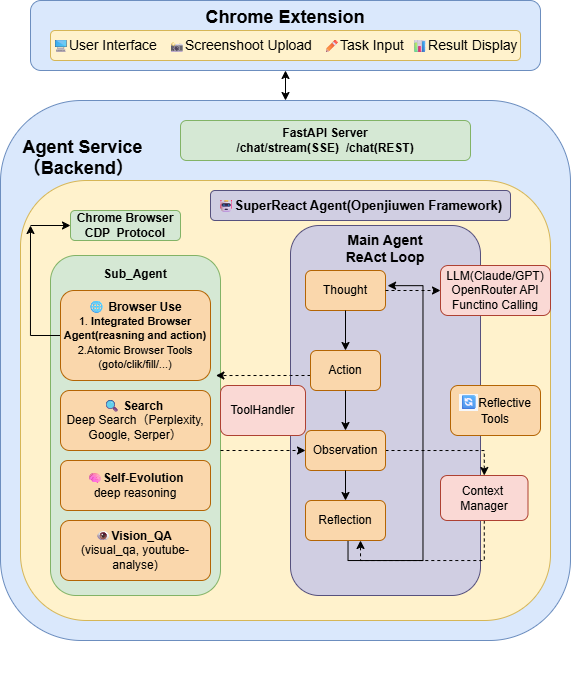

<p align="center">
  
</p>

<h1 align="center">Browser Pilot</h1>

<p align="center">
  <b>🧠 Next-Gen Browser-Level AI Copilot — Understands Web Semantics, Executes Complex Tasks, Auto-Decides & Acts</b>
</p>

<p align="center">
  <a href="#-demo-videos">Demo Videos</a> •
  <a href="#-core-features">Core Features</a> •
  <a href="#-quick-start">Quick Start</a> •
  <a href="#-architecture">Architecture</a> •
  <a href="README.md">中文</a>
</p>

<p align="center">
  
  
  
</p>

---

## 💡 Project Overview

**Browser Pilot** is an intelligent browser assistant plugin built on the [OpenJiuwen Agent Framework](https://gitcode.com/openJiuwen/agent-core). It not only deeply understands web content but also reasons, plans, and executes based on user intent — acting as a true AI copilot that automatically completes multi-step, cross-page complex tasks.

> 🎯 **Tell it what you want to do, and it will think, execute, and even learn from failures.**

### What Can It Do?

| 🔍 Smart Q&A | 💼 Office Assistance | 🛒 Complex Tasks | 🔄 Self-Evolution |
|:---:|:---:|:---:|:---:|
| Direct Q&A on web content | Auto-reply to emails | Watch recipe video → Auto-add ingredients to cart | Auto-reflect on failures |
| Precise screenshot region recognition | Excel data processing | Cross-app multi-step workflows | Context-based learning optimization |
| Deep Search | Form filling & submission | Price comparison, booking, ordering | Gets smarter with use |


## ✨ Core Features

### 1️⃣ Visual Question Answering (VQA)

**Let AI see everything you see**

- **Web Q&A**: Open any webpage, directly ask AI about page content
- **Screenshot Recognition**: Select any screen region, AI answers based on image content
- **Deep Search**: Complex questions auto-decomposed, multi-round search, deep summarization

### 2️⃣ Smart Office

**Let AI handle repetitive work**

- **Email Processing**: Read email content, understand context, auto-compose professional replies
- **Excel Processing**: Data cleaning, formula calculation, chart generation, report export
- **Form Filling**: Smart field recognition, auto-fill and submit

### 3️⃣ Long-Duration Complex Tasks

**Cross-app, multi-step, seamless execution**

- **Example Scenario**: Watch recipe video/article → Extract ingredient list → Open shopping app → Auto-add to cart
- **Workflow Orchestration**: Auto-plan task steps, sequential execution, exception handling
- **Cross-Platform Coordination**: Seamless connection between browser and local apps

### 4️⃣ Self-Evolution

**AI that gets smarter with use**

- **Failure Reflection**: Auto-analyze reasons when tasks fail
- **Context Learning**: Optimize execution strategies based on interaction history
- **Self-Correction**: Adjust approach and retry until success

---

## 🚀 Quick Start

Browser Pilot consists of a **Browser Plugin (Frontend)** and an **Agent Service (Backend)**.

### Requirements

- Python 3.11+
- [uv](https://github.com/astral-sh/uv) package manager
- Node.js 18+
- Chrome browser

---

### Backend Installation

#### 1. Clone Repository

```bash
git clone https://github.com/xxxx/browser-pilot.git
cd browser-pilot
```

#### 2. Install Dependencies

```bash
# Install uv (if not already installed)
# Windows: powershell -c "irm https://astral.sh/uv/install.ps1 | iex"
# macOS/Linux: curl -LsSf https://astral.sh/uv/install.sh | sh
uv sync
# Activate virtual environment
.\.venv\Scripts\Activate.ps1
## Install openjiuwen and browser-use
uv pip install openjiuwen==0.1.2
uv pip install browser-use==0.11.2

```

#### 3. Configure Environment Variables

Create `.env` file:

```bash
# Recommended: Use OpenRouter (supports multiple models)
API_BASE=https://openrouter.ai/api/v1
API_KEY=your_openrouter_api_key
MODEL_NAME=anthropic/claude-sonnet-4-20250514
MODEL_PROVIDER=openrouter
```

#### 4. Start Services

**Windows:**
```powershell
# Start
.\start_agent.ps1
```

**macOS:**
```bash
./start_agent.sh

```

---

### Frontend Installation

#### Start Chrome Browser
**Windows:**
```powershell
# Start
.\browser_start_client.ps1
```

**macOS:**
```bash
./browser_start_client.sh
```

#### Load Plugin into Browser

1. Visit `chrome://extensions/`
2. Enable "Developer mode" in top right
3. Click "Load unpacked"
4. Select `frontend/dist` directory
5. Open the plugin, click settings and enter http://localhost:8000 in Backend_URL

---

### Verify Installation

1. Ensure backend services (port 8930 + port 8000) are running
2. Open any webpage
3. Click Browser Pilot icon in browser toolbar
4. Enter a question to test if AI responds normally

---

## 🏗️ Architecture

### Overall Architecture

<p align="center">
  
</p>


### Technical Highlights

| Feature | Description |
|---------|-------------|
| **SuperReAct** | Enhanced ReAct loop: Think → Act → Observe, supports multi-round iterative reasoning |
| **Browser Use** | Browser automation, cross-page, multi-step task execution |
| **Reflective Evolution** | Auto-reflect on failures, adjust strategy and retry, gets smarter with use |
| **Multimodal Visual Understanding** | Supports visual understanding and Q&A for web content and screenshot regions |

### Supported Models

Recommended to use **[OpenRouter](https://openrouter.ai/)** for unified access (supports 100+ models), while also compatible with direct API connections to various providers:

| Provider | Models |
|----------|--------|
| **Anthropic** | Claude Sonnet 4 (Recommended), Claude Opus 4 |
| **OpenAI** | GPT-4o, O3, O3-mini |
| **Google** | Gemini 2.0 Pro/Flash |
| **Others** | Qwen, DeepSeek, Llama, etc. |

---

## 🤝 Contributing

Contributions are welcome!

1. Fork this repository
2. Create feature branch (`git checkout -b feature/new-feature`)
3. Commit changes (`git commit -m 'Add new feature'`)
4. Push branch (`git push origin feature/new-feature`)
5. Submit Pull Request

## 📄 License

[Apache License 2.0](LICENSE)

## 🔗 Related Links

- [OpenJiuwen Agent Framework](https://gitcode.com/openJiuwen/agent-core) - Underlying Agent framework

---

<p align="center">
  <b>⭐ If you find this helpful, please give us a Star!</b>
</p>
