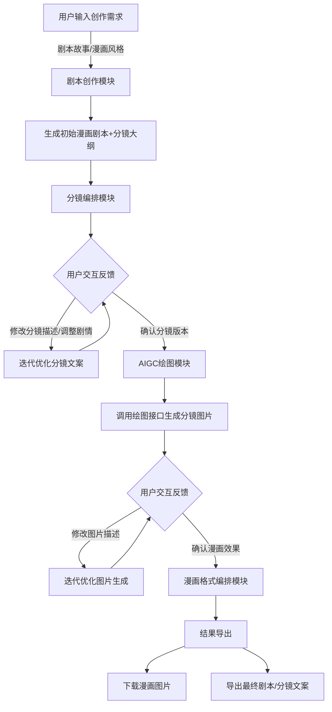

# ComicCreatorAgent 🎨
[](https://www.python.org/)

一站式漫画创作智能 Agent，覆盖「剧本创作→分镜编排→AIGC 绘图→漫画格式自动编排」全流程，支持 Flask Web 端交互和本地离线运行，大幅降低漫画创作门槛。

## 🎨 场景介绍
随着生成式人工智能技术的快速发展，**多模态大语言模型**的叙事创作与交互能力、**文生图大模型**的风格化视觉生成能力均实现质的突破，为漫画创作的智能化革新提供了核心支撑。传统漫画创作门槛高，需兼顾剧本撰写、分镜设计、绘画渲染等多重技能，且流程割裂、效率低下；普通创作者虽有创意，却常因技术限制难以落地。同时，单一 AI 工具功能分散，无法形成 “文字到画面” 的创作闭环。
在此背景下，**漫画创作 Agent** 应运而生。它深度整合大语言模型与文生图大模型的能力，打通 “需求输入→脚本生成→分镜优化→图像渲染” 的全流程，以自然语言交互降低创作门槛，让用户仅凭创意描述就能快速产出风格化漫画作品，推动漫画创作从 “专业专属” 走向 “全民可及”。


## ✨ 核心功能
| 核心模块 | 核心能力 |
|----------|----------|
| 剧本创作 | 漫画剧本自动生成、台词润色、剧情大纲梳理，适配各种风格漫画剧本生成 |
| 分镜编排 | 基于与用户的实时交互反馈，迭代修改剧情分镜的文字描述，优化分镜的场景、角色动作、镜头语言等内容，输出符合绘图需求的精细化分镜文案|
| AIGC 绘图 | 集成 nano-banana/Seedream 4.5 等多种绘图接口，支持参考图（URL/Base64）、多尺寸/格式生成以及用户自定义修改 |
| 双端运行 | Web 端（Flask）可视化交互，本地端离线快速调试，满足不同使用场景 |
| 辅助工具 | image_search工具，终端和web交互工具，漫画格式编排工具 |

## 🚀 快速使用
### 1. 启动漫画创作Agent
Web端启动
```bash
python flask_web_agent.py
```
浏览器打开http://127.0.0.1:5000

本地启动
```bash
python local_agent.py
```
### 2. 项目文件结构
```bash
ComicCreatorAgent/
├── templates/                # Web前端模板文件夹
│   └── index.html            # Web前端页面（交互界面）
└── backend/                  # 后端核心文件夹
    ├── comic_script_creator.py    # 剧情创作模块
    ├── comic_pics_creator.py      # 漫画图片创作模块
    ├── comic_layout_formatter.py  # 漫画格式编排模块
    ├── aigc_image_generator.py    # 文生图大模型交互
    ├── local_agent.py             # 本地运行入口
    └──flask_web_agent.py          # Web端运行入口
```

### 3. 漫画创作Agent创作流程

### 4. 漫画创作Agent效果展示

