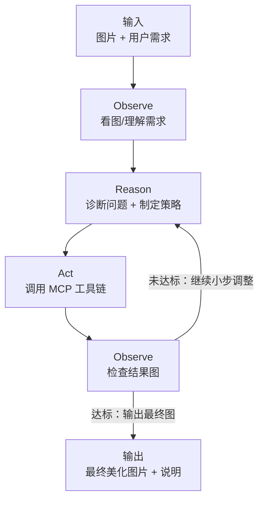

# 图片编辑Agent：多模态智能美化 + MCP 工具编排（ReAct 多轮）

本 Agent 是一个 **图文多模态** 的图片美化助手：它可以同时理解“图片内容”和“用户文字需求”，先诊断需要改进的点，再通过 **MCP 工具**进行参数化编辑，并以 **ReAct 多轮迭代**的方式逐步逼近最佳效果（支持连续编辑）。

---

## 多模态智能美化能力（核心）

它不仅能“按指令改图”，还会先 **看图分析** 再 **制定策略**：

- **看图理解（Vision-Language）**：输入不仅是文字，还包含图片本身（画面内容、色彩、光照、主体/背景、风格氛围）。
- **自动诊断**：识别影响观感的问题或可提升点，例如：
  - 亮度偏低/偏高、对比度不足、灰雾感
  - 色彩偏冷/偏暖、饱和度不足/过饱和
  - 细节不够清晰、边缘不够锐利
  - 需要更符合“喜庆模式 / 深色模式 / 自然清透 / 商务高级”等目标风格
- **策略规划**：把模糊主观的需求（“更高级”“更喜庆”“更适合深色 UI”）转译为一组可执行的图像操作顺序与参数。
- **工具落地**：选择合适的工具链路执行（而不是固定模板），并在每一步执行后“再看一次结果”，决定是否继续迭代。

---

## MCP 工具（可被 Agent 调用的能力集合）

Agent 通过 MCP Server 暴露的工具来完成“可控、可复现”的编辑动作。当前系统提示词中声明的工具包括：

- **信息与诊断**
  - `get_image_info`：读取图片尺寸/格式/文件大小等基础信息（也可作为诊断入口）
- **画面增强（常用）**
  - `adjust_brightness`：调整亮度
  - `adjust_contrast`：调整对比度
  - `adjust_saturation`：调整饱和度
  - `adjust_sharpness`：调整锐度
- **几何与构图**
  - `resize_image`：调整尺寸
  - `crop_image`：裁剪
  - `rotate_image`：旋转
- **风格与格式**
  - `apply_filter`：应用滤镜（如 blur/sharpen 等）
  - `convert_format`：格式转换

### 常见调用约束（约定）

- **`output_path` 必填**：每次工具调用都应显式指定输出路径，便于链式组合与回溯。
- **`factor` 常用范围**：通常在 `0.0 ~ 2.0`，`1.0` 为不变；小步迭代更容易得到稳定结果（例如 1.05/1.1/1.2）。

---

## ReAct 多轮迭代：让“看图 → 调工具 → 再看图”闭环成立

该 Agent 采用 **ReAct（Reason + Act）** 思路组织多步编辑：

1. **观察（Observe）**：读取用户需求 + 看图（必要时先 `get_image_info`）。
2. **推理（Reason）**：确定主要问题与目标风格，规划一个短链路（1~3 步）先验证方向。
3. **行动（Act）**：调用 1~N 个 MCP 工具生成阶段性结果（写入 `output_path`）。
4. **再观察（Observe）**：基于新图片判断是否达标；如未达标，继续下一轮迭代（调整参数/换工具/补充操作）。
5. **收敛（Converge）**：达到目标后输出最终结果，并给出文字说明（做了哪些调整、为什么）。

### 迭代流程图（Mermaid）

