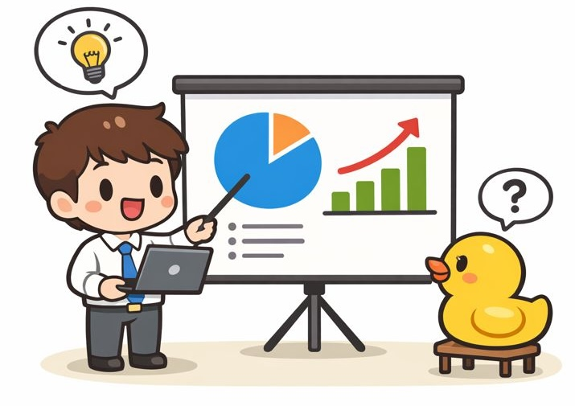

# 🎤 Presentation Agent

<div align="center"> 

</div>

<p align="center">
  <a href="./README.md"></a>
</p>

<p align="center">
    <a href="#"></a>
     <a href="https://gitcode.com/openJiuwen/agent-core"></a>
   <a href="https://www.python.org/downloads/release/python-3120/"></a>
    <a href="#"></a>
</p>


---

<details open>
<summary><b>📕 目录</b></summary>

* 💡 [Presentation Agent 是什么？](#-presentation-agent-是什么)
* 🎮 [Demo](#-demo)
* 🌟 [主要功能](#-主要功能)
* 🧩 [系统架构](#-系统架构)
* ⚙️ [工程化设计理念](#️-工程化设计理念)
* 🛠️ [核心模块说明](#️-核心模块说明)
* 🚀 [快速开始](#-快速开始)
* 📜 [路线图](#-路线图)

</details>

---

## 💡 Presentation Agent 是什么？

**Presentation Agent** 是基于 [OpenJiuwen Workflow  Agent Framework](https://gitcode.com/openJiuwen/agent-core) 构建的一款面向技术型演讲与工程汇报场景的 AI 演示助手，
专注解决以下痛点：

* **好PPT准备 ≠ 好表现**——独自练习顺畅，上台才暴露逻辑断层与重点模糊演讲，缺乏“有效反馈机制”
* 用户“茶壶煮饺子，有货倒不出”
* 技术汇报容易**照稿念**、节奏失控
* 复杂系统设计**讲不清重点**
* 工程转型、架构升级**逻辑混乱**
* 复盘缺乏**量化反馈**

> 核心定位：
> **让技术演讲像系统设计一样“可控、可复盘、可持续优化”**

它通过：

* PPT 结构解析
* 演讲实时引导
* 智能演讲稿生成
* 练习过程追踪
* 自动复盘报告生成

构建一套完整的 **“工程化演讲闭环系统”**。


---

## 🎥 Demo

[Presentation Agent Demo](demo.mp4)


---

## 🌟 主要功能

### 🎯 实时演讲引导（Presenter View）

* 不再“照本宣科”
* 不同演示阶段：

  * 自动高亮关键数据
  * 红框提示核心论点
  * 关键结论强提醒

> 例如：
> **“MachineLearning Kit提供了场景化能力”（框图高亮）**

---


### 📝 智能演讲稿（K歌模式）

* Agent 根据 PPT 自动生成**演讲稿**
* 练习时：

  * 已读内容自动变灰
  * 当前句高亮
  * 关键点自动标红
* 类似：

> 🎤 KTV 歌词跟读体验

---

### 🔍 练习过程追踪

* 语速
* 停顿
* 跳页
* 重点是否覆盖
* 超时/提前结束统计


---

### 📊 自动复盘报告

练习结束自动生成：

* 总体评分
* 表现雷达图
* 问题定位
* 优化建议
* 下次训练目标


---

### 🧠 右侧思维导图辅助

* 当前页：

  * 逻辑结构图
  * 论点拆解树
* 帮助演讲者：

  * 把控整体逻辑
  * 防止跑题


---

## 🧩 系统架构

```
                ┌──────────────┐
                │   PPT Parser │
                └──────┬───────┘
                       │
            ┌──────────▼──────────┐
            │  Presentation Agent │
            └──────────┬──────────┘
                       │
    ┌──────────┬──────────────┬──────────┐
    │          │              │          │
┌───▼───┐ ┌─────▼─────┐ ┌──────▼─────┐ ┌───▼───┐
│实时引导│ │演讲稿生成  │ │行为分析模块 │ │复盘引擎│
└───────┘ └───────────┘ └────────────┘ └───────┘
```

---

## ⚙️ 工程化设计理念

### 1️⃣ 组织转型背景

* 从「经验驱动」→「数据驱动」
* 从「拍脑袋演讲」→「可量化训练」

---

### 2️⃣ 架构设计原则

* **模块解耦**
* **状态可追踪**
* **全链路可观测**
* **可插拔策略引擎**

---

### 3️⃣ 迭代策略

* MVP 快速验证
* 数据驱动优化
* Prompt 可版本化
* 组件级 AB Test

---

## 🛠️ 核心模块说明

### 🎤 Presenter Coach

* 当前页关键点识别
* 动态提醒策略
* 风险提示（超时/跑题）

---

### 📜 Script Engine

* 从 PPT 结构 → 自动生成讲稿
* 支持：

  * 技术型
  * 业务型
  * 高管汇报型

---

### 📈 Behavior Analyzer

* 语速检测
* 逻辑跳跃检测
* 重点覆盖率计算

---

### 🧾 Review Generator

* 自动输出复盘报告
* 支持导出：

  * PDF
  * Markdown
  * 企业知识库

---

## 🚀 快速开始

```bash
git clone https://gitcode.com/xiehanchen_riemann/openJiuwen-XHYDemo.git

```

---

## 📜 路线图

* [x] PPT 结构解析
* [x] 实时引导 MVP
* [ ] 多语言支持
* [ ] 团队训练模式
* [ ] 企业知识库对接
* [ ] 个性化风格建模

---

## 🎉 关注项目

⭐️ Star 支持项目，让更多工程师**告别流水账式汇报**！

---

