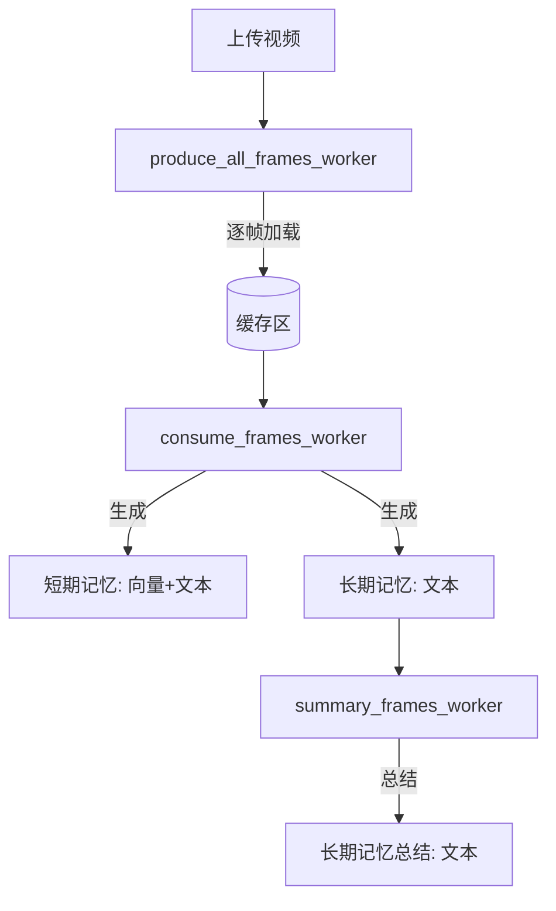
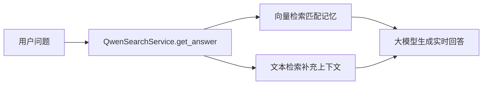

# 屏内流式记忆Agent

## 📖 概要介绍
**屏内流式记忆Agent** 是一套面向多模态流式记忆与推理的系统。它通过 **手机、智能眼镜等终端设备** 持续感知并落盘多模态数据（视频、音频、文本等），对相关记忆信息进行归纳存储，并在 **T+1 时刻** 从多维度提供高效的记忆内容，显著增强更深层次的推理能力与高级记忆能力。  

系统支持：
- 📡 **实时感知**：多终端、多模态数据流接入
- 🧠 **记忆归纳**：跨时间片的关键信息提炼与结构化存储
- 🔍 **多维检索**：基于语义、时间、空间等维度快速定位记忆
- 🤖 **推理增强**：结合上下文记忆进行复杂问答与决策支持

---

## 🏗️ 方案设计

屏内流式记忆Agent执行流程分为两个流程：上传屏内视频流程和运行问答过程。

### 上传屏内视频过程
在上传流程中，系统首先由 produce_all_frames_worker 将视频逐帧解码，并把每一帧放入缓存区。这样做的目的是把连续的视频流拆解成独立的图像帧，方便后续处理，同时缓存区起到生产者与消费者之间的缓冲作用。随后 consume_frames_worker 从缓存区取出帧，生成两类记忆：短期记忆（向量与文本，用于快速检索和上下文理解）以及长期记忆（文本形式，用于持久存储）。当所有帧处理完成后，summary_frames_worker 会对长期记忆进行总结，形成更高层次的文本概览，帮助系统快速回顾视频整体内容。



- **produce_all_frames_worker**：逐帧读取视频 → 缓存区
- **consume_frames_worker**：构造短期记忆（向量+文本）与长期记忆（文本）
- **summary_frames_worker**：消费完成后对长期记忆做文本总结

---

### 运行问答过程

在运行问答过程中，当用户提出问题后，系统会调用 QwenSearchService.get_answer 作为入口。这个服务首先会执行两类检索：一方面通过 向量检索 在已有的记忆库中找到与问题最相关的语义向量，从而匹配到相似的内容；另一方面通过 文本检索 补充上下文，确保问题不仅有语义上的匹配，还能结合具体的文本信息来丰富答案。这样，系统就能同时利用结构化的向量记忆和原始文本上下文。在完成检索后，系统会将两部分结果整合起来交给大模型。大模型基于这些检索到的记忆和上下文，生成一个实时回答。这个过程保证了回答既有准确的语义匹配，又能结合具体的文本细节，从而让最终输出更完整、更贴近用户的问题。




- **QwenSearchService.get_answer**：执行向量 & 文本检索 → 调用大模型实时回答

---

## 📌 收益亮点

屏内流式记忆Agent能够在视频上传过程中，将连续的屏幕内容逐帧解码，并通过短期记忆（向量+文本）与长期记忆（文本）进行分层存储。这种分层归纳机制让系统既能保持即时响应，又能兼顾长期知识积累。在完成视频处理后，系统会对长期记忆进行总结，形成更高层次的文本概览。到 **T+1 时刻**，用户或系统可以从多个维度（语义、时间、上下文）快速获取记忆内容。这种多维度供给方式显著提升了记忆的可用性和检索效率。在问答过程中，Agent不仅依赖单一的检索结果，而是将向量匹配与文本检索结合，再交由大模型生成回答。这使得 Agent 是一个兼并信息存储和具备认知与推理能力的智能体。  

---


## 💻 安装要求
在开始之前，请确保环境满足以下要求：

- Python >= **3.10.17**
- PyTorch >= **2.6.0**
- CUDA Version >= **12.4**

安装依赖：
```bash
pip install -r requirements.txt
```

---

## 🧩 预训练模型
StreamingQA 依赖以下预训练模型，请提前下载或在首次运行时自动加载：

- [OFA-Sys/chinese-clip-vit-large-patch14](https://huggingface.co/OFA-Sys/chinese-clip-vit-large-patch14)  
- [IDEA-Research/grounding-dino-base](https://huggingface.co/IDEA-Research/grounding-dino-base)  

---

## ⚡ API 快速上手

### 1. 运行管理态（上传相关视频）
- 用于管理数据流、上传视频、触发记忆归档等操作
```bash
python3 -m service.qa.app.demo_manager_app
```

### 2. 运行运行态（实时问答）
- 用于实时接收用户提问，并结合流式记忆进行多模态推理与回答
```bash
python3 -m service.qa.app.demo_qa_openjiuwen
```

---

## 📂 代码组织
推荐的项目目录结构如下（可根据实际情况调整）：

```
StreamingQA_Anxin/
├── service/
│   └── qa/
│       └── app/
│           ├── demo_manager_app.py   # 管理态入口
│           ├── demo_qa_app.py        # 运行态入口
│           └── ...
│       └── serve/
|           ├── qwen_local_service.py # 运行参数表
|           └── ...
├── process/
│   └── multimodal/
│           ├── pipeline_factory.py   # 多路流水线
│           ├── basic_config.yaml     # 服务器参数表
|           └── ...
├── data/                             # 数据缓存与落盘目录
├── requirements.txt
├── README.md
└── ...
```

---