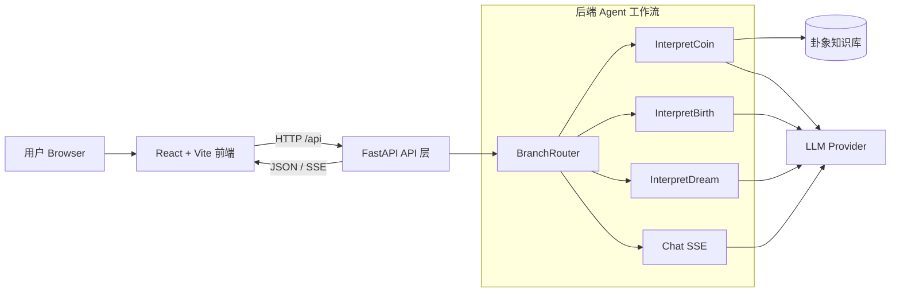

# 凡人大衍卜 · Fortune Telling Agent

> 基于 AI Agent 的传统文化占卜与命理解读应用，前后端一体，支持六爻、八字、解梦与流式对话。后端 AI Agent 基于 [openJiuwen](https://openjiuwen.com/) v0.1.3 开发。

[](https://www.python.org/downloads/)
[](https://fastapi.tiangolo.com/)
[](https://react.dev/)
[](LICENSE)

---

## 项目简介

**凡人大衍卜** 是一款基于 AI Agent 的传统文化占卜与命理解读应用，前后端一体，支持六爻摇卦、生辰八字、周公解梦与大师流式对话。后端采用 [openJiuwen](https://openjiuwen.com/) 构建智能体工作流，结合轻量知识库与可配置 LLM，为传统文化场景提供可扩展的解读能力。

- **项目地址**：[https://gitcode.com/KevinYi94/FortuneTellingAgent](https://gitcode.com/KevinYi94/FortuneTellingAgent)

---

## 功能概览

| 功能 | 说明 |
|------|------|
| **每日一卦** | 摇铜钱六爻，自动映射 64 卦，结合知识库与 LLM 生成解读 |
| **生辰八字** | 结构化输入生辰，先算四柱/五行/十神等命盘，再由 Agent 解读 |
| **周公解梦** | 输入梦境描述，由 Agent 生成解梦内容 |
| **大师闲聊** | 与「大师」进行 SSE 流式对话，支持多轮问答 |

所有解读内容仅供娱乐与参考，不构成任何决策建议。

### 功能展示

| 欢迎页 | 每日一卦 |
|--------|----------|
|  |  |

| 生辰八字 | 周公解梦 |
|----------|----------|
|  |  |

| 大师闲聊 |
|----------|
|  |

展示视频：[demo.mp4](resources/demo.mp4)

---

## 技术栈

| 层级 | 技术 |
|------|------|
| **后端** | Python 3.13、FastAPI、uv、Pydantic、Uvicorn |
| **前端** | React 19、Vite 7、TypeScript、Tailwind CSS v4、shadcn/ui、Zustand、Framer Motion |
| **AI / 知识** | 可配置 LLM（含 Mock）、轻量知识库、多子工作流编排 |

---

## 项目整体架构图



---

## 环境要求

- **Python** `3.13`
- **包管理** [uv](https://docs.astral.sh/uv/)
- **Node.js** 与 **npm**（前端构建与开发）

---

## 快速开始

### 1. 克隆与依赖

```bash
git clone <repository-url>
cd FortuneTellingAgent
uv sync
cd frontend-react && npm install && cd ..
```

### 2. 环境变量

在项目根目录创建 `.env`（可参考 `.env.example`）：

```env
OPENAI_API_KEY=your_key
OPENAI_API_BASE=https://api.openai.com/v1
LLM_MODEL_PROVIDER=mock
LLM_MODEL_NAME=mock-fortune-model
```

`LLM_MODEL_PROVIDER=mock` 时无需真实 API Key，便于本地开发与联调。

### 3. 启动

**开发模式（推荐，带 HMR）：**

```bash
# Windows
start-dev.bat

# 或手动：终端1 运行后端，终端2 运行前端
uv run python backend/main.py
# 另一终端
cd frontend-react && npm run dev
```

- 前端：<http://127.0.0.1:5173/>
- 后端 API：<http://127.0.0.1:8000/>
- Vite 已将 `/api` 代理到后端。

**生产式一键启动（构建 + 后端托管前端）：**

```bash
start-prod.bat
```

访问 <http://127.0.0.1:8000/> 即可。

---

## 项目结构

```
FortuneTellingAgent/
├── backend/
│   ├── app/
│   │   ├── agents/          # 主 Agent 与路由
│   │   ├── api/             # FastAPI 路由
│   │   ├── core/             # 配置与异常处理
│   │   ├── knowledge/        # 轻量知识库
│   │   ├── models/           # Pydantic 模型
│   │   ├── nodes/            # 工作流节点封装
│   │   ├── prompts/          # 提示词模板
│   │   ├── services/         # 业务服务（摇卦、LLM 等）
│   │   └── workflows/        # Chat / InterpretCoin / InterpretBirth / InterpretDream
│   └── tests/                # 单元测试与接口测试
├── frontend-react/
│   ├── src/
│   │   ├── pages/            # 路由页面
│   │   ├── components/       # 业务与 UI 组件
│   │   ├── hooks/            # 复用逻辑（如 SSE）
│   │   ├── lib/              # API 与工具
│   │   └── store/            # Zustand 状态
│   └── dist/                 # 构建产物（可由后端托管）
├── docs/
│   └── api-contract.md       # API 请求/响应契约
├── start-dev.bat             # 开发一键启动
├── start-prod.bat            # 生产一键启动
└── README-community.md       # 本文件
```

---

## 前端路由

| 路径 | 说明 |
|------|------|
| `/` | 欢迎页与功能入口 |
| `/coin` | 每日一卦（六爻） |
| `/birth` | 生辰八字 |
| `/dream` | 周公解梦 |
| `/chat` | 大师闲聊 |

统一使用侧栏布局（`SplitLayout`），页脚含免责提示。

---

## API 概览

| 方法 | 路径 | 说明 |
|------|------|------|
| POST | `/api/toss_coin` | 单次摇卦（3 枚铜钱；前端需调用 6 次得六爻） |
| POST | `/api/fortune_tell/interpret_coin` | 六爻卦象解读（非流式） |
| POST | `/api/fortune_tell/calculate_birth` | 仅计算生辰八字命盘（不调 Agent） |
| POST | `/api/fortune_tell/interpret_birth` | 生辰解读（非流式） |
| POST | `/api/chat/fortune_tell/interpret_dream` | 周公解梦（非流式） |
| POST | `/api/chat/stream` | SSE 流式聊天 |
| GET | `/api/health` | 健康检查 |

完整请求/响应字段见 [docs/api-contract.md](docs/api-contract.md)。

---

## 后端架构简述

- **主 Agent + BranchRouter**：根据请求类型分发到不同子工作流。
- **子工作流**：
  - **Chat**：流式对话（SSE）。
  - **InterpretCoin**：六爻铜钱 → 64 卦映射 → 知识检索 → LLM 解读。
  - **InterpretBirth**：生辰 → 命理计算 → LLM 解读。
  - **InterpretDream**：梦境描述 → LLM 解梦。

---

## 测试

```bash
uv run pytest backend/tests -q
```

---

## 贡献与反馈

欢迎通过 Issue 与 Pull Request 参与：提交前请确保 `uv run pytest backend/tests -q` 通过。

---

## 免责声明

本项目的占卜、八字、解梦等内容仅供娱乐与文化体验，不构成任何投资、医疗、法律或人生决策建议。请理性看待，谨慎参考。
